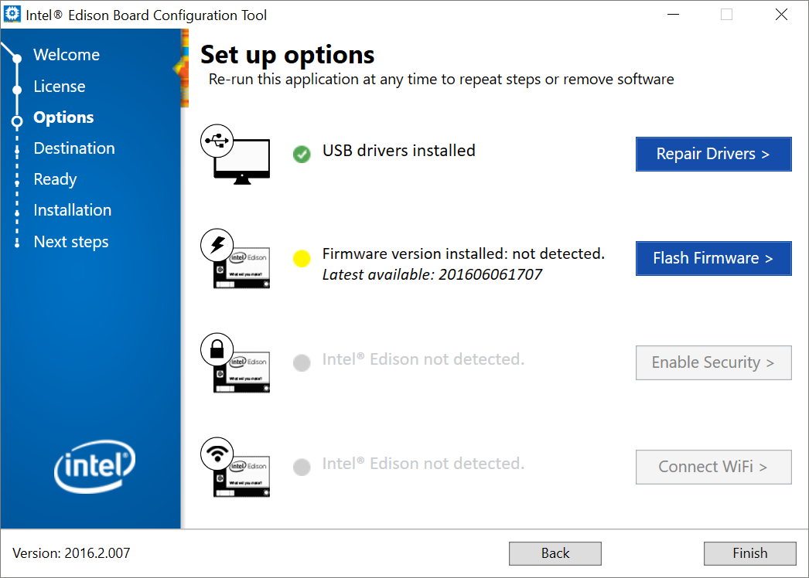

# Innovation-Day: Internet of Things - Install Edison

You will need:

* A ssh client (like [putty](http://www.putty.org/))
* The Intel&reg; Edison Drivers: https://software.intel.com/en-us/iot/hardware/edison/downloads

## Drivers Configuration

During the drivers configuration you will be able to change the board name and the password for the *root* user.



> If your event host has already set a password for you, ask before changing it :^^:


## Connecting to your Edison Board

Once installed you will have something like this in your device manager, with several Serial Ports, the two Intel Edison ports are for debugging, but there is a *USB Serial Port(COMXX)*:


The red mark indicates the COM port you will need to setup in your ssh client, take a look on which port you have in your computer and use it as the port in the putty configuration:


Once you have connected through serial with the COM port at 115200 bauds, you will get a screen like this (you may have to press the enter key to get a message):


## WiFi Configuration

If you didn't configure your WiFi during the first setup, you still can configure it from your board using the command:

``` 
    configure_edison --wifi
``` 

Where you will get a list of available WiFi networks to connect:


## Start the Lab

The next steps depend on each lab, just go to the [Labs page](./README.md) and start.

