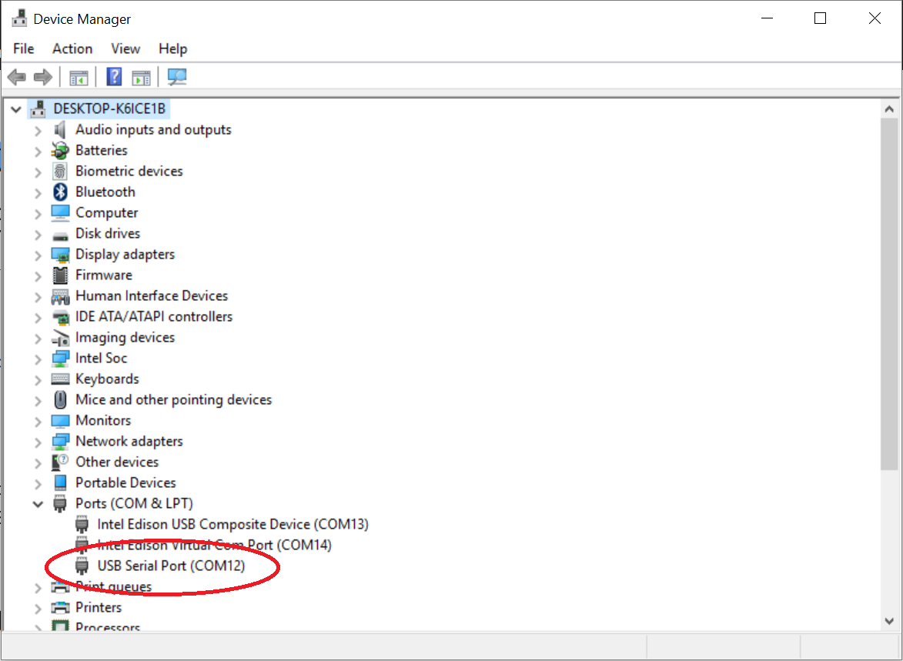
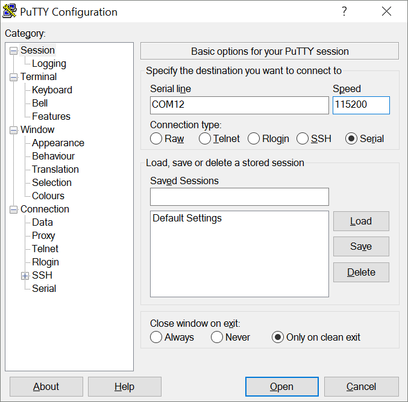
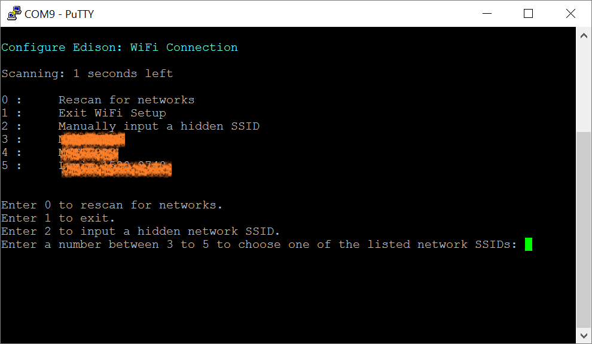

# Innovation-Day: Internet of Things - Install Edison

But first of all you will need to install your Intel Edison Board. You will need:

* A ssh client (like [putty](http://www.putty.org/))
* The Intel Edison Drivers: https://software.intel.com/en-us/iot/hardware/edison/downloads

## Drivers Configuration


## Connecting to your Edison Board

Once installed you will have something like this in your device manager:



The red mark indicates the COM port you will need to setup in your ssh client:



Once you have connected through serial with the COM port at 115200 bauds, you will get a screen like this (you may have to press the enter key to get a message):


## WiFi Configuration

If you didn't configure your WiFi during the first setup, you still can configure it from your board using the command:

``` 
    configure_edison --wifi
``` 

Where you will get a list of available WiFi networks to connect:




## Start the Lab

The next steps depend on each lab, just go to the [Labs page](./README.md) and start.

