# Innovation-Day: Internet of Things - Node-red Lab

[Node-red](http://nodered.org) is an IoT platform that lets you build IoT Solutions with a graphical interface.

## Node-red installation

For using node-red with an Intel Edison board you will have to login inside the board and run the following commands:

First install node-red:

```
    npm install -g node-red
```

You can run node-red by typing

```
    node-red
```

and you will be able to open a web browser in

        http://[boardaddress]:1880

You just stop it with *CTRL+C*, then you can install some useful modules like *upm* to use the sensors in the Grove Kit

```
    npm install -g node-red-contrib-upm
```

And finally you install the module to connect to IoT Hub:

```
    npm install -g node-red-contrib-azureiothubnode
```

## Lab

Now you begin a step-by-step lab, but feel free to tinker and play with the hardware.

### 1. Connect the Grove Kit sensors
Start by connecting the Grove Base Shield to your Edison Arduino Board.

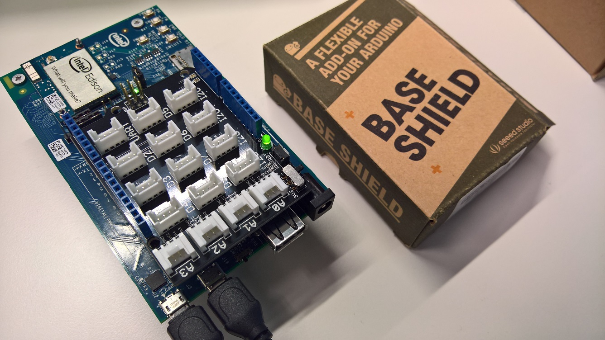

Then you will need to find these components:
- The two leds (green and blue)
- The temperature sensor
- The button

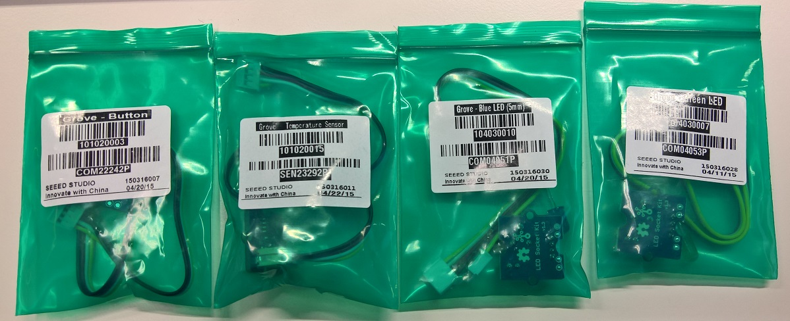

Connect the components to their corresponding ports:

* Green Led : D2
* Grove Button: D3
* Blue Led: D4
* Temp Sensor: A0

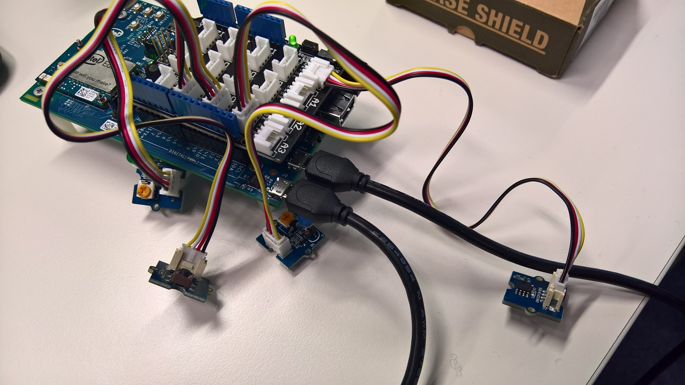

### 2. Create a flow in node-red

#### Start Node-RED
Now, inside the Intel&reg; Edison board you start the node-red server, just typing `node-red`

> Note: you may run `ifconfig` command before running *node-red* to know the ip address of your board.

Open the address http://[edisonipaddress]:1880 with a browser, it's the Node-RED application that lets you create IoT workflows.

#### Make the LEDs blink
In the nodes selector, find the **UPM_Sensors** section and drag a *Grove LED* node.

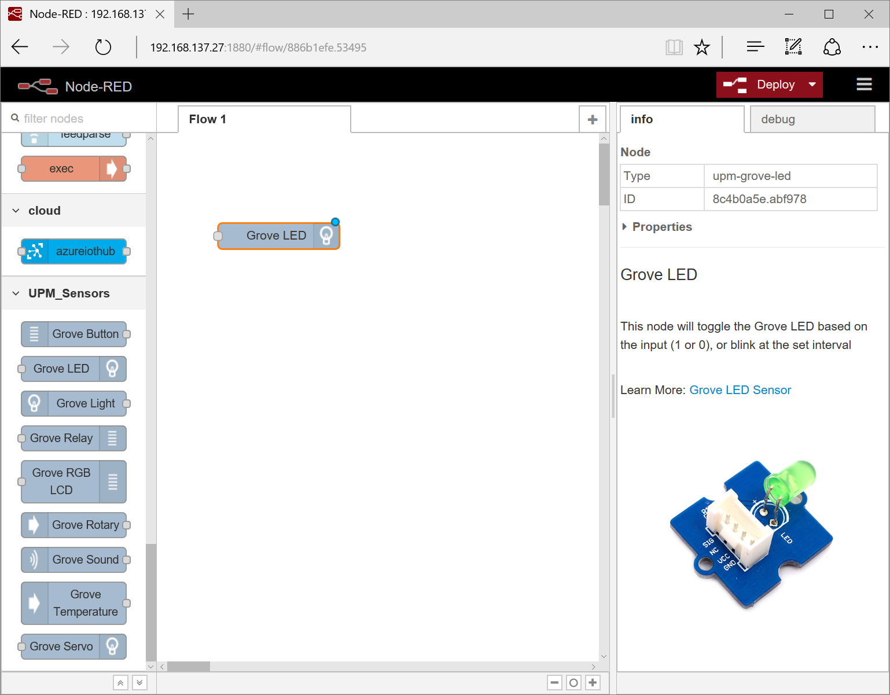

Double clicking the node you can configure it. Set its name to GreenLed and the Pin to D2:

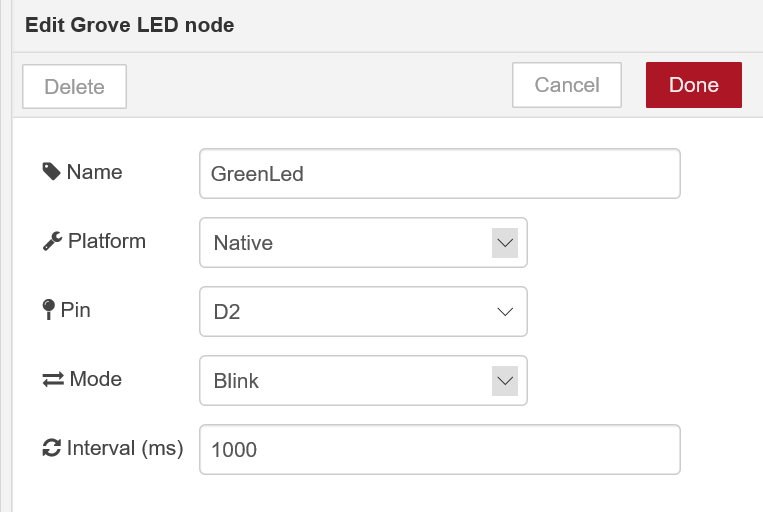

Repeat this operation for the Blue led in D4.

Click on the **Deploy** button, and you must see the two leds blinking.

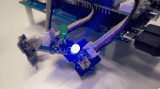

### Create a workflow

In Node-red you can connect the nodes, so we will do connect the button to the green led. Add a *Grove Button* node, link it to the Green LED and set the Pin to D3:

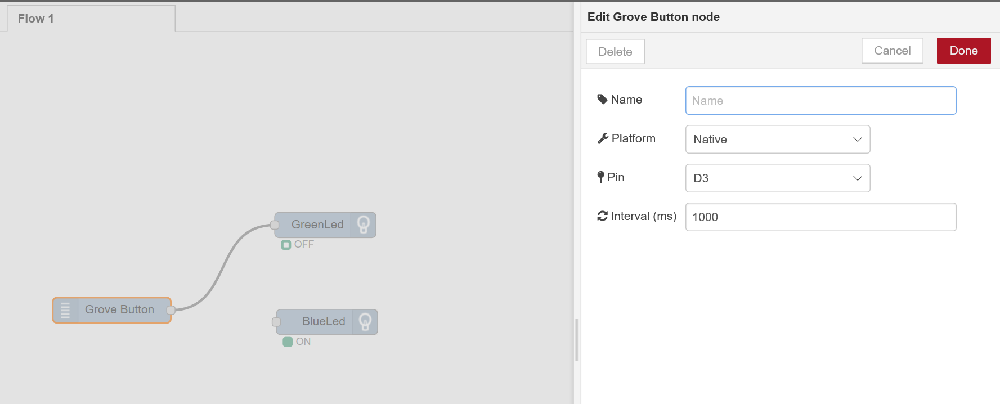

You have to change the configuration of the LED, change the mode to output instead of interval:

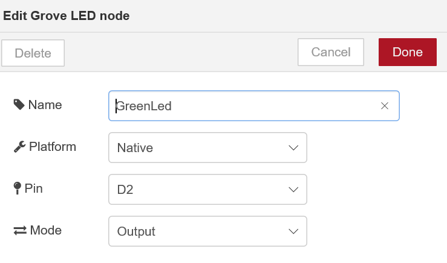

Once deployed, you will be able to switch on the green light using the button.

### Use the temperature in the workflow

Now we will use the temperature sensor to change the LED state. Add a *Grove Temperature* node, a *function* node and a *debug* node as well, so we can see the temperatures in the debug tab.

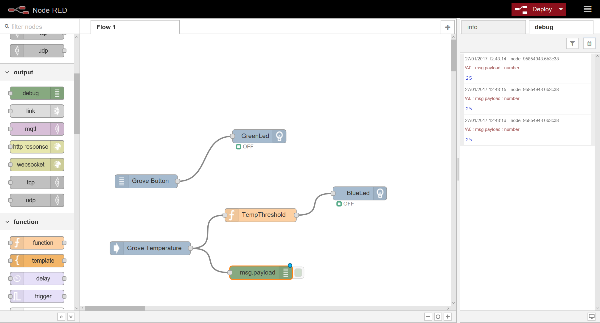

Configure the temperature sensor in the A0 pin and write this function inside the TempThreshold function:

```
var temp = msg.payload;
if(temp>30){
    msg.payload=1;
}
else{
    msg.payload=0;
}
return msg;
```

### 3. Create a IoT Hub

Now we will send the data to the cloud. We will need some more things for this, here's your bill of materials:
* An Azure account with a IoT Hub
* A visualization WebSite
* The Azure node in your Node-RED workflow

#### Create a IoT Hub

In your browser go to the Azure Portal at https://portal.azure.com and login. Create a new IoT Hub with `new > Internet of Things > IoT Hub`.

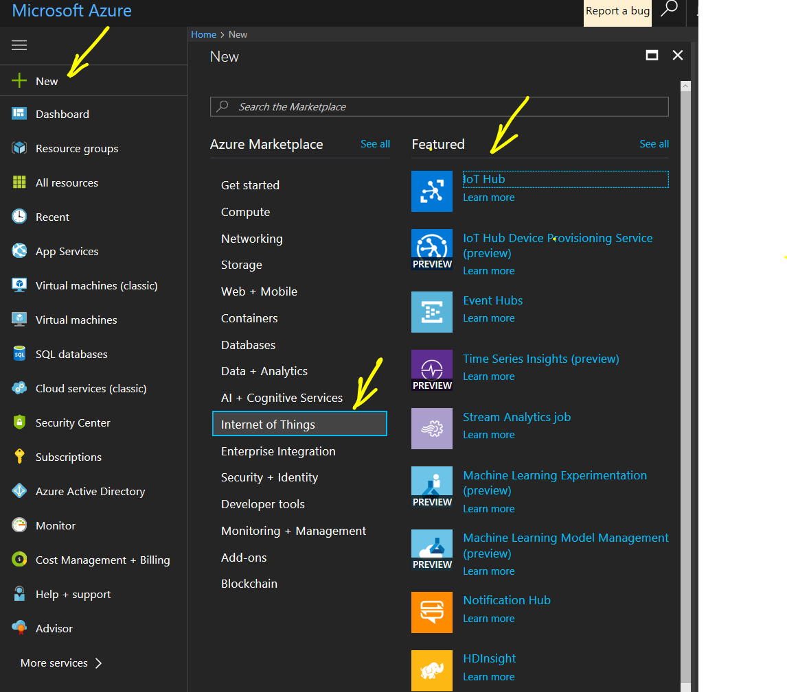

Once created, select the IoT Hub, click on the **Key** icon (Shared access policies) and select **iothubowner** from the policy. Click the **copy** button next to the *Connection String - Primary Key* to copy it to the clipboard.

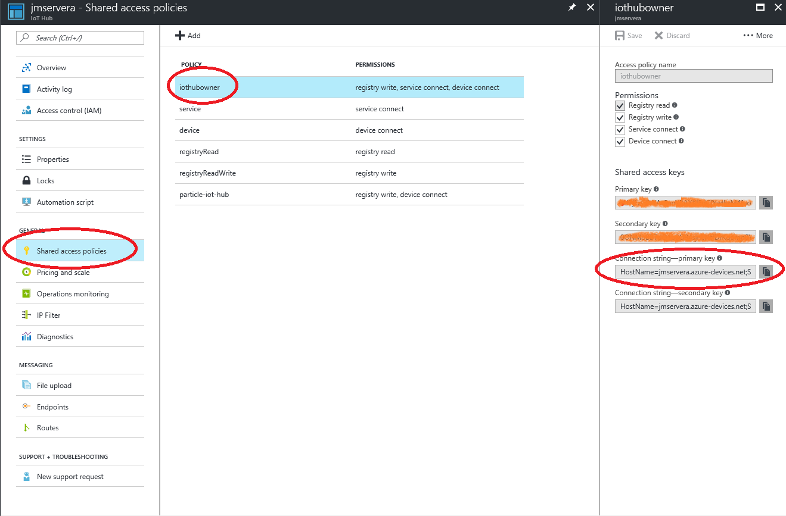

##### Create the IoT Device

Install the IoT Hub Explorer command line:
```
npm install -g iothub-explorer
```

Run the following command to get a connection string for your device:

```
iothub-explorer login "[YOUR CONNECTION STRING]" create EdisonNodeRed --connection-string

iothub-explorer create EdisonNodeRed --connectionstring
```

And you will get a screen like this:

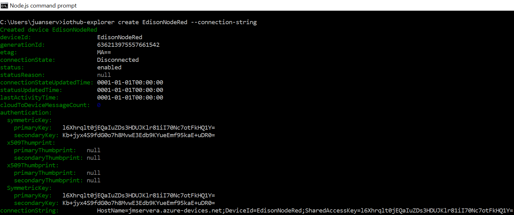

### 4. Deploy a visual Web App

Deploy dashboard: https://github.com/ThingLabsIo/ThingLabs-IoT-Dashboard like in http://thinglabs.io/labs/edison/grove/visualize/


### 5. Receive Cloud to Device messages
 
## More

You can run Node-RED in many platforms, including Azure: https://nodered.org/docs/platforms/azure

