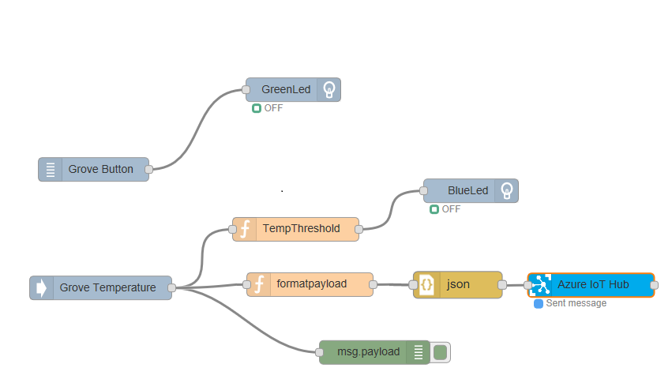

# Innovation-Day: Internet of Things - Node-RED Lab

<a href="http://nodered.org"> Node RED</a> is an IoT platform that lets you build IoT Solutions with a graphical interface. It can be installed in any node enabled device, PC or VM.

## Prerequisites
This lab is using the Grove Starter Kit for Intel Edison, so you may have to prepare your device first, just follow this [Intel Edison installation tutorial](installedison.md) and then install the Node-RED environment.

### Node-RED installation

For using node-red with an Intel Edison board you will have to login inside the board and run the following commands:

First install node-red:

```
    npm install -g node-red
```

Then you can install some useful modules like *upm* to use the sensors in the Grove Kit, and also the module to connect to Azure IoT Hub:

```
    npm install -g node-red-contrib-upm && npm install -g node-red-contrib-azureiothubnode
```

### Running Node-RED
You need to know the IP address of your board, just type the command ```ifconfig``` and take your *wlan* address.

Once installed, you can run node-red by typing:

```
    node-red
```

You will see the server running like this:


And to start to use it, you just open a web browser from your client machine using the board address (the one you got using ```ifconfig```).

        http://[boardaddress]:1880

> Whenever you need to stop the server, just press *CTRL+C*, but remember to save your work before stopping the server.

## Start the Node-RED and Azure IoT Hub Lab

Now that you have your environment completely prepared you can begin this step-by-step lab, but feel free to tinker and play with the hardware.

### 1. Connect the Grove Kit sensors
Start by connecting the Grove Base Shield to your Edison Arduino Board.


Then you will need to find these components:
- The two LEDs (green and blue)
- The temperature sensor
- The button


Connect the components to their corresponding ports:

* Green Led : D2
* Grove Button: D3
* Blue Led: D4
* Temp Sensor: A0


> Notice that the LEDs are connected to **D**igital endpoints and the temperature sensor is connected to an **A**nalog endpoint.

### 2. Create a flow in node-red

#### Start Node-RED
Now, inside the Intel&reg; Edison board you start the node-red server, just typing `node-red`

> Note: you may run `ifconfig` command before running *node-red* to know the ip address of your board.

Open the address http://[edisonipaddress]:1880 with a browser, it's the Node-RED application that lets you create IoT workflows.

#### Make the LEDs blink
In Node-RED you run **Flows** that you edit in your browser app. In a Flow you drag'n'drop the nodes, that provide functionality to your flow.

In the nodes selector, find the **UPM_Sensors** section and drag a *Grove LED* node.


Double clicking the node you can configure it. Set its name to GreenLed and the Pin to D2:


Repeat this operation for the Blue led in D4.

Click on the **Deploy** button, and you must see the two leds blinking.


### Create the first Flow

You can connect the nodes to create the program flow: react to events, send data to the cloud, modify a value, etc. We will use a button to turn the green LED on when the button is pressed.

Add a *Grove Button* node, link it to the Green LED and set the Pin to D3:


You have to change the configuration of the LED, so it doesn't blink but it reacts to the button operation. You do this by changing the mode to output instead of interval:


Once deployed, you will be able to switch on the green light using the button.

### Use the temperature in the workflow

Now we will use the temperature sensor to change the LED state. Add a *Grove Temperature* node, a *function* node and a *debug* node as well, so we can see the temperatures in the debug tab.


Configure the temperature sensor in the A0 pin and write this function inside the TempThreshold function:

```
var temp = msg.payload;
if(temp>30){
    msg.payload=1;
}
else{
    msg.payload=0;
}
return msg;
```

This code changes the msg.payload, a special property that is used by the nodes and is passed between them, so we are transforming the output payload depending on the input value.

### 3. Create a IoT Hub

To make this data more useful, we will send it to the cloud. We will need some more things for this, here's your bill of materials:
* An Azure account with an IoT Hub service created
* A visualization WebSite
* The Azure node in your Node-RED Flow

Let's do it:

#### Create an IoT Hub

> If you don't have an Azure Account you can get a [Free Trial](https://azure.microsoft.com/free).

In your browser go to the Azure Portal at https://portal.azure.com and login. Create a new IoT Hub with `new > Internet of Things > IoT Hub`.


Once created, select the IoT Hub, click on the **Key** icon (Shared access policies) and select **iothubowner** from the policy. Click the **copy** button next to the *Connection String - Primary Key* to copy it to the clipboard.


##### Create the IoT Device

Now we will create a secure device Id and Key to connect to the IoT Hub you have created. This is done from your computer using the IoT Hub owner credentials you just copied before.

From your computer, install the IoT Hub Explorer command line:
```
npm install -g iothub-explorer
```

Now, run the following command to get a connection string unique for your device, this allows maximum device security and bi-directional communication with the device:

```
iothub-explorer login "[YOUR CONNECTION STRING]"
iothub-explorer create EdisonNodeRed --connection-string
```

And you will get a screen like this:


From here we can create the connection string for the device with the primaryKey:

```
HostName=[hubname].azure-devices.net;DeviceId=EdisonNodeRed;SharedAccessKey=[new-device-key]
```
Connect a new function node to the Temperature output and write this function, that creates a string with a JSON object that we will send through the wire to IoT Hub.

```
msg.payload =JSON.stringify({
    "sensor":"temp",
    "value": msg.payload,
    "timestamp": new Date()
})
return msg;
```
Then add an *azureiothub* node, and set the connection string. The one you got before for the device using the *iothub-explorer*. You will end with a diagram similar to this one:



Once you deploy the diagram, you will start sending data to your IoT Hub.

### 4. Deploy a visual Web App

Deploy dashboard: https://github.com/ThingLabsIo/ThingLabs-IoT-Dashboard like in http://thinglabs.io/labs/edison/grove/visualize/


### 5. Receive Cloud to Device messages
 
## More

You can run Node-RED in many platforms, including Azure: https://nodered.org/docs/platforms/azure

