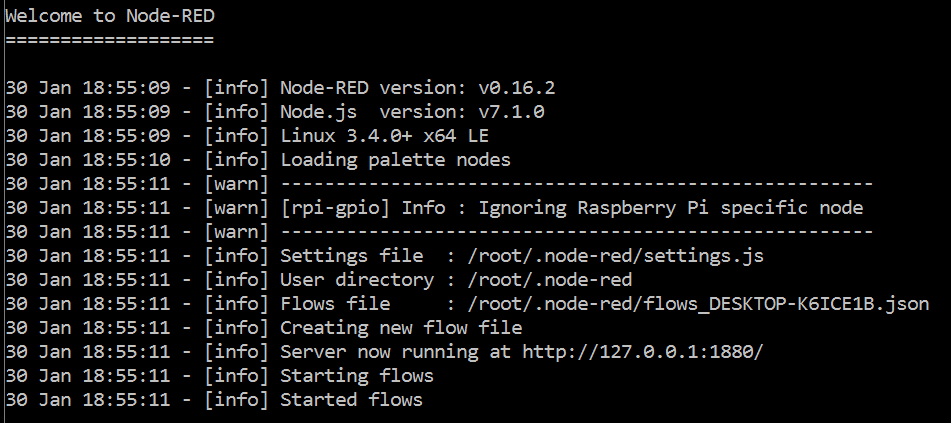

# Innovation-Day: Internet of Things - Node-RED Lab. 1. Prerequisites

This lab is using the Grove Starter Kit for Intel Edison, so you may have to prepare your device first, just follow this [Intel Edison installation tutorial](installedison.md) and then install the Node-RED environment.

## Node-RED installation

For using node-red with an Intel Edison board you will have to login inside the board and run the following commands:

First install node-red:

```bash
    npm install -g node-red
```

Then you can install some useful modules like *upm* to use the sensors in the Grove Kit, and also the module to connect to Azure IoT Hub:

```bash
    npm install -g node-red-contrib-upm && npm install -g node-red-contrib-azureiothubnode
```

## Running Node-RED

You need to know the IP address of your board, just type the command ```ifconfig``` and take your *wlan* address.

Once installed, you can run node-red by typing:

```bash
    node-red
```

You will see the server running like this:



And to start to use it, you just open a web browser from your client machine using the board address (the one you got using ```ifconfig```).

        http://[boardaddress]:1880

> Whenever you need to stop the server, just press *CTRL+C*, but remember to save your work before stopping the server.

---
Continue to [Step 2](./node-red_lab_2.md) or return to [index](node-red_lab.md).