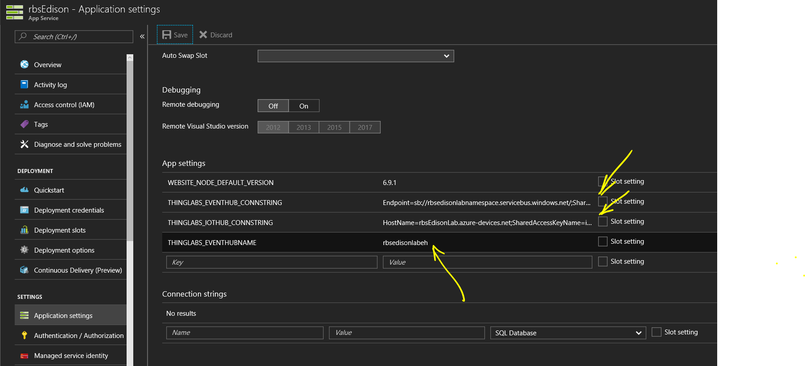

# Innovation-Day: Internet of Things - Node-RED Lab 4. Visualize your data

Now you need a dashboard where to visualize the data you are sending, but, before we will prepare the incoming telemetry to show more relevant data, with average, minimum and maximum values.

## Event Hubs

Event Hubs is a message pub/sub, we will use it to send and receive the averages to represent them inside the website. Create a new Event Hubs in the Azure portal with `New > Internet of Things > Event Hubs` and create a new unique namespace:


And then you must create an Event Hub, call it **thinglabseventhub**:


We will use this Event Hub in the Stream Analytics as output and in the WebSite as input.

## Stream Analytics Creation

We will create an Azure Stream Analytics Job. In the Azure portal go create a new ASA:


Configure one input as the IoT Hub you created before:


And for the output, we will use the Event Hub we created before.
Configure the Event Hub as the output of the ASA:


Finally you create a Query and with this *select* statement:

```sql
    WITH ProcessedData as (
        SELECT
            MAX(sensorValue) MaxTemperature,
            MIN(sensorValue) MinTemperature,
            AVG(sensorValue) AvgTemperature,
            location,
            deviceId,
            System.Timestamp AS Timestamp
        FROM
            [input]
        WHERE
            sensorType = 'temperature'
        GROUP BY
            TumblingWindow (second, 5), deviceId, location
    )

    -- Make sure this matches your Event Hub output name from above,
    -- If you've forgotten it you can go back and get it in another browser tab
    SELECT * INTO [output] FROM ProcessedData
```

Now you just start this ASA with the *Start button*, this will start calculating the minimum, maximum and average of the incoming data in a 5 second window.

## Visualization website

To show the result, we have prepared for you a website that draws the data using the [D3.js](https://d3js.org) library. You will deploy this app to an Azure App Service:

> This procedure uses the same site like the one found in [ThingLabs.io](http://thinglabs.io/labs/edison/grove/visualize/)


1. First you create a WebApp by selecting *New > Web + Mobile > Web App*:


2. Configure the deployment options to an External Repository:


3. And set the *Repository URL* to this one: **https://github.com/ThingLabsIo/ThingLabs-IoT-Dashboard.git**

4. You must set the WebSockets property to on:


5. Then you set this two properties in your *Application Settings* section:

    a. Set THINGLABS_EVENTHUB_CONNSTRING to the connection string you got from your Event Hub
    b. Set THINGLABS_IOTHUB_CONNSTRING to the general IoT Hub connection string you did set up before
    c. Set THINGLABS_EVENTHUBNAME, only if your Event Hub is not named *thinglabseventhub*



Now, go to your website and you will see the data in graphical form. You may have to wait some minutes to the ASA to start feeding values.


---
Continue to [Step 5](./node-red_lab_5.md) or return to [index](node-red_lab.md).