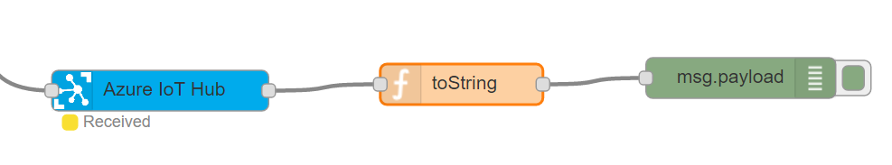
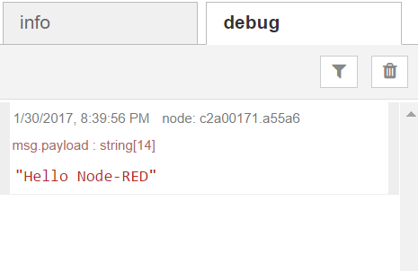
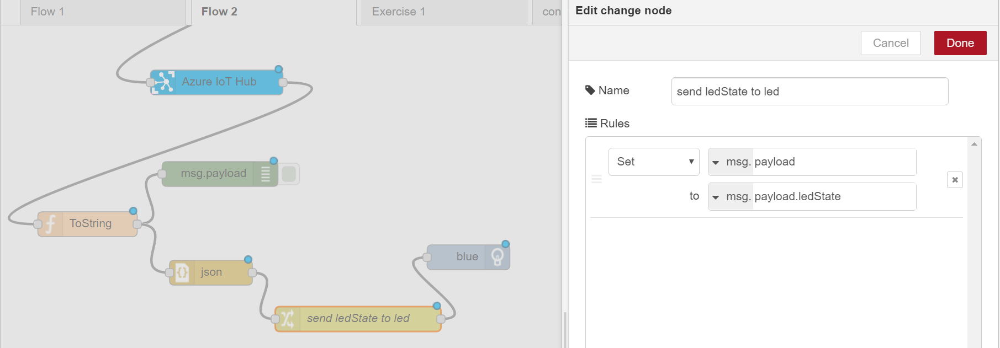
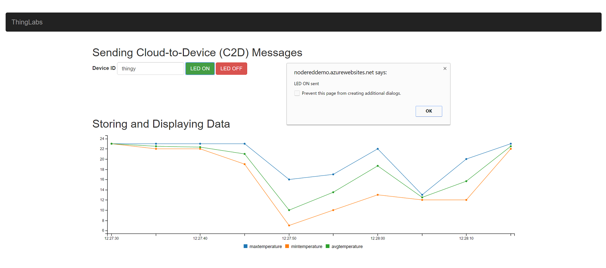

# Innovation-Day: Internet of Things - Node-RED Lab 5. Receive Cloud to Device messages

Add a new function node and set this code, it converts an array of bytes into a string:

```javascript
msg.payload = 
 String.fromCharCode.apply(null, 
      new Uint16Array(msg.payload));
return msg;
```

Then connect the output of the *Azure IoT Hub* node you already have to the function and the function output to a *debug* node like this:



Now from your command line you can send a message to your device:

```bash
iothub-explorer send EdisonNodeRed "Hello Node-RED"
```

You can see the messages sent to your device in the *debug* tab:



To make it more interesting, we will switch a light remotely, with the help of the recently created website.

## Connecting a LED to manage it remotely

In Node-RED we will convert the string to an object again with the *JSON* node and a *Change* node that will move the information in the *ledState* property directly inside the payload when configured like this:



Connect at the end your blue LED and deploy it.

If you go to the site and set the name of the created device (EdisonNodeRed), you can send messages to the device from the website.



> Get the full Flow that you can paste in Node-RED [here](./flows/fullex.json).


---
Return to [index](node-red_lab.md).