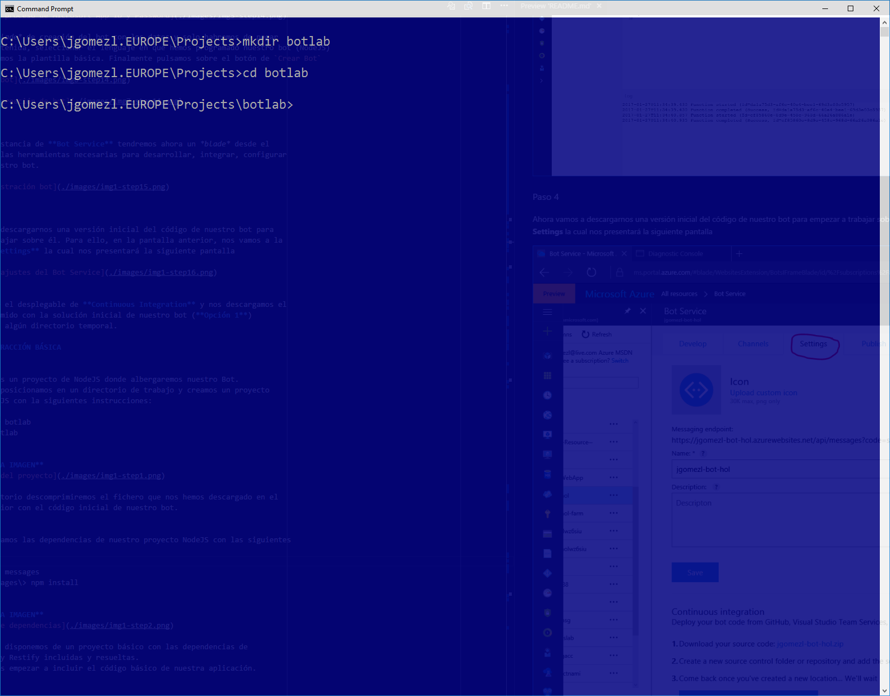
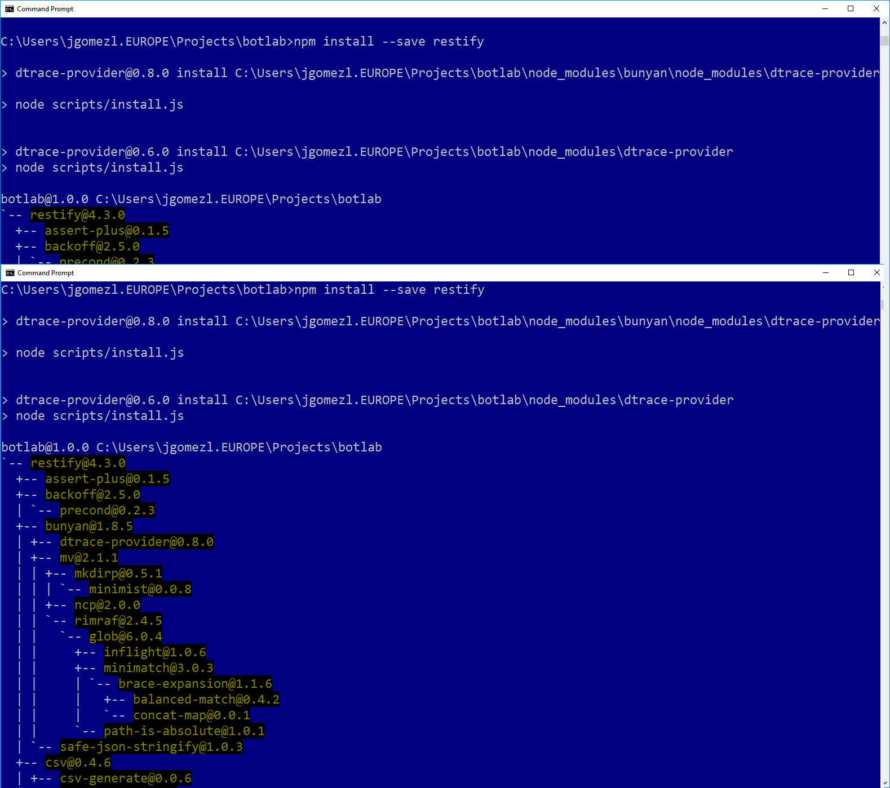
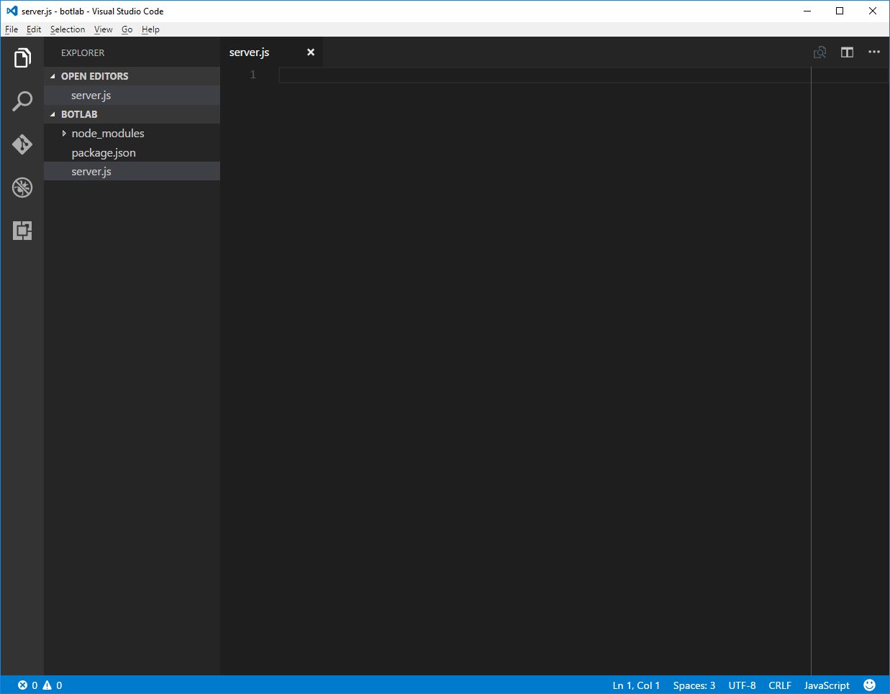

# BOT FRAMEWORK + LUIS
## INTRODUCCIÓN
En este hands-on-lab vamos a desarrollar un "bot" utilizando **Bot Framework SDK**
 y le dotaremos de la capacidad de entender lenguaje natural utilizando además 
 **Language Understanding Interface Service (LUIS)** que es parte de los 
 **Microsoft Cognitive Services**.

## ANTES DE EMPEZAR 
Para ello es importante tener nociones básicas de programación, preferiblemente 
en NodeJS y también ciertas nociones básicas de algunos de los servicios básicos 
de PaaS de Azure (WebApp)

Igualmente, para el correcto desarrollo del Hands-On-Lab es recomendable 
disponer de los siguientes recursos hardware y software:

### REQUERIMIENTOS HARDWARE 
* PC o laptop con Windows 8, 8.1 o 10, Linux (Ubuntu o similar) o Mac  

### REQUERIMIENTOS SOFTWARE 
* Visual Studio 2015 o superior, o bien
* Visual Studio Code (disponible en Windows, Mac OS o Linux)
* NodeJS (6.94 LTS o superior)
* NPM
* Git cliente (v1.8.5 o superior)

### OTROS REQUERIMIENTOS
* Subscripción a Azure o posibilidad de desplegar una aplicación NodeJS en 
un servidor web visible en internet
* Estar registrado como desarrollador de Cognitive Services. 
Para más información visitar la siguiente 
[página](https://www.microsoft.com/cognitive-services/en-us/)  

## PREPARACIÓN DEL PROYECTO

1.	Primero creamos un proyecto de NodeJS donde albergaremos nuestro Bot. 
Para ello nos posicionamos en un directorio de trabajo y creamos un proyecto
 vacio de NodeJS con la siguientes instrucciones:
 ~~~~
    C:\> mkdir botlab
    C:\> cd botlab
    C:\botlab> npm init
    <<rellenar las preguntas>>
    ...
~~~~

Ahora en este punto disponemos de un proyecto vacío con soporte para NodeJS.
A partir de aquí tendremos que empezar a cargar las dependencias necesarias para
 que el proyecto funcione con el Bot Framework y LUIS.

2. En la misma consola y posicionados dentro del directorio de proyecto,
cargaremos las dependencias del proyecto. Para ello utilizaremos las 
siguientes instrucciones:
~~~~
C:\> npm install --save botbuilder
…
C:\> npm install --save restify
…
~~~~

En este punto, disponemos de un proyecto básico con las dependencias de 
Bot Framework y Restify incluidas y resueltas. 
Ahora deberemos empezar a incluir el código básico de nuestra aplicación.

3. Abrimos Visual Studio Code dentro del directorio de la solución. 
Para ello, desde la línea de comandos, introducimos la siguiente instrucción:
~~~~
C:\> code . 
~~~~
Esto nos abrirá Visual Studio Code y abrirá la carpeta del proyceto. También
podemos abrir Visual Studio Code desde el menú de inicio de Windows y una vez
dentro del editor, utilizar la opción `File>Open Folder...` 

Creamos el fichero inicial de nuestro proyecto (`server.js`). Esto lo 
podemos realizar desde dentro del editor, utilizando la opción `File>New File...`

