# BOT FRAMEWORK + LUIS
* [INTRODUCCIÓN](#introducción)
* [ANTES DE EMPEZAR](#antes-de-empezar)
  * [REQUERIMIENTOS HARDWARE](#requerimientos-hardware)
  * [REQUERIMIENTOS SOFTWARE](#requerimientos-software)
  * [OTROS REQUERIMIENTOS](#otros-requerimientos)
* [PREPARACIÓN DEL PROYECTO](#preparacion-del-proyecto)
* [GENERACIÓN DEL SERVIDOR WEB PARA EL BOT](#generacion-del-servidor-web-para-el-bot)
* [INTERACCIÓN BÁSICA CON NUESTRO BOT](#interaccion-basica-con-nuestro-bot)
* [INTERACCIÓN AVANZADA CON NUESTRO BOT](#interaccion-avanzada-con-nuestro-bot)
* [DESPLIEGUE DE LA SOLUCIÓN EN AZURE](#despliegue-de-la-solucion-en-azure)

## INTRODUCCIÓN
En este hands-on-lab vamos a desarrollar un "bot" utilizando **Bot Framework SDK**
 y le dotaremos de la capacidad de entender lenguaje natural utilizando además 
 **Language Understanding Interface Service (LUIS)** que es parte de los 
 **Microsoft Cognitive Services**.

## ANTES DE EMPEZAR 
Para ello es importante tener nociones básicas de programación, preferiblemente 
en NodeJS y también ciertas nociones básicas de algunos de los servicios básicos 
de PaaS de Azure (WebApp)

Igualmente, para el correcto desarrollo del Hands-On-Lab es recomendable 
disponer de los siguientes recursos hardware y software:

### REQUERIMIENTOS HARDWARE 
* PC o laptop con Windows 8, 8.1 o 10, Linux (Ubuntu o similar) o Mac  

### REQUERIMIENTOS SOFTWARE 
* Visual Studio 2015 o superior, o bien
* Visual Studio Code (disponible en Windows, Mac OS o Linux)
* NodeJS (6.94 LTS o superior)
* NPM
* Git cliente (v1.8.5 o superior)

### OTROS REQUERIMIENTOS
* Subscripción a Azure o posibilidad de desplegar una aplicación NodeJS en 
un servidor web visible en internet
* Estar registrado como desarrollador de Cognitive Services. 
Para más información visitar la siguiente 
[página](https://www.microsoft.com/cognitive-services/en-us/)  

## PREPARACIÓN DEL PROYECTO

### Paso 1
Primero creamos un proyecto de NodeJS donde albergaremos nuestro Bot. 
Para ello nos posicionamos en un directorio de trabajo y creamos un proyecto
 vacio de NodeJS con la siguientes instrucciones:
 ```powershell
    C:\> mkdir botlab
    C:\> cd botlab
    C:\botlab> npm init
    <<rellenar las preguntas>>
    ...
```


Ahora en este punto disponemos de un proyecto vacío con soporte para NodeJS.
A partir de aquí tendremos que empezar a cargar las dependencias necesarias para
 que el proyecto funcione con el Bot Framework y LUIS.

### Paso 2
En la misma consola y posicionados dentro del directorio de proyecto,
cargaremos las dependencias del proyecto. Para ello utilizaremos las 
siguientes instrucciones:
```powershell
C:\> npm install --save botbuilder
…
C:\> npm install --save restify
…
```


En este punto, disponemos de un proyecto básico con las dependencias de 
Bot Framework y Restify incluidas y resueltas. 
Ahora deberemos empezar a incluir el código básico de nuestra aplicación.

### Paso 3
Abrimos Visual Studio Code dentro del directorio de la solución. 
Para ello, desde la línea de comandos, introducimos la siguiente instrucción:
```powershell
C:\> code . 
```
Esto nos abrirá Visual Studio Code y abrirá la carpeta del proyceto. También
podemos abrir Visual Studio Code desde el menú de inicio de Windows y una vez
dentro del editor, utilizar la opción `File>Open Folder...` 

Creamos el fichero inicial de nuestro proyecto (`server.js`). Esto lo 
podemos realizar desde dentro del editor, utilizando la opción `File>New File...`


## GENERACIÓN DEL SERVIDOR WEB PARA EL BOT

### Paso 4
Llegados a este punto, primeramente, hemos de crear una aplicación de
API REST que responda a las interacciones con los usuarios a través de los
diferentes canales. Para ello, dentro del fichero `server.js` incluiremos 
el siguiente código:

```javascript 
var restify = require('restify');
var builder = require('botbuilder');

//=========================================================
// Bot Setup
//=========================================================

// Setup Restify Server
var server = restify.createServer();
server.listen(process.env.port || process.env.PORT || 3978, function () {
   console.log('%s listening to %s', server.name, server.url); 
});
  
// Create chat bot
var connector = new builder.ChatConnector({
    appId: process.env.MICROSOFT_APP_ID,
    appPassword: process.env.MICROSOFT_APP_PASSWORD
});
var bot = new builder.UniversalBot(connector);
server.post('/api/messages', connector.listen());

//=========================================================
// Bots Dialogs
//=========================================================

bot.dialog('/', function (session) {
    session.send("Hello World");
});
```

Ahora disponemos de una aplicación REST API básica desarrollada con NodeJS
que integra un Bot con diálogo básico `"Hello World!"`. Para comprobarlo 
deberemos arrancar la aplicación web.

### Paso 5
Dentro de la consola de comandos posicionada dentro del directorio de la
solución tecleamos la siguiente instrucción:
```powershell
C:\botlab> node server.js
```

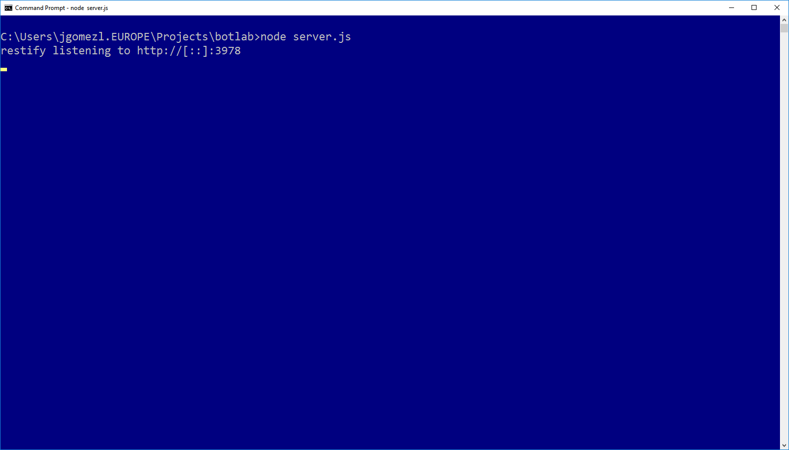

## INTERACCIÓN BÁSICA CON NUESTRO BOT

Como vemos, ahora mismo Restify ha generado un servidor web escuchando sobre el 
puerto 3978 de nuestra máquina. Para comprobar el funcionamiento de este Bot 
básico, precisamos utilizar el **Microsoft Bot Framework Emulator**, quien nos 
proporcionará de un emulador de chat conectado con nuestro Bot.

El **Microsoft Bot Framework Emulator** se encuentra disponible para descarga 
en la siguiente dirección:

[Download Microsoft Bot Framwork Emulator](https://github.com/Microsoft/BotFramework-Emulator#download)  

### Paso 6
Descargamos e instalamos el emulador, siguiendo las instrucciones de la
página para los diferentes sistemas operativos soportados.

_Se debe de tener en cuenta que el emulador se instalará dentro del menú de 
inicio en una opción denominada `Microsoft Corp`_ 

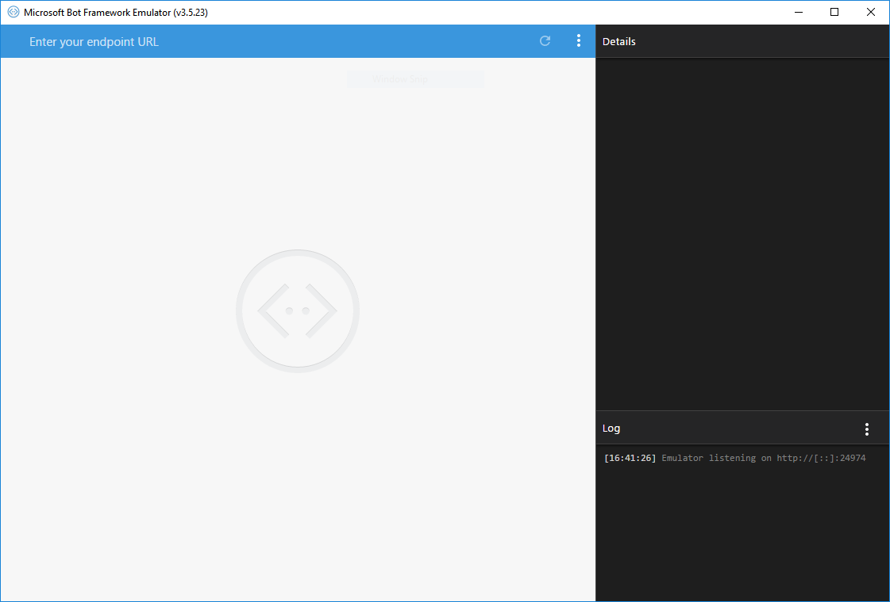

### Paso 7
Con la aplicación web en ejecución (_ver paso 5_) conectamos el emulador 
con ella utilizando la dirección [http://localhost:3978/api/messages](http://localhost:3978/api/messages)

_Es importante tener en cuenta que no es necesario rellenar los campos de 
**Microsoft App Id** ni **Microsfot App Password** que aparecen en la pantalla siguiente_

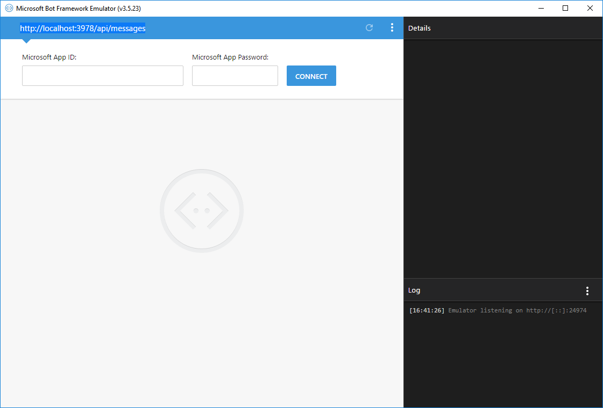

Si se precisan instrucciones detalladas para la depuración del bot en local, 
en el siguiente enlace las tenemos disponibles

[Getting Started - Connect to a bot running on localhost](https://github.com/Microsoft/BotFramework-Emulator/wiki/Getting-Started#connect-to-a-bot-running-on-localhost)

### Paso 8
Probamos a interacturar con nuestro bot. Para ello introducimos un saludo en 
la caja de texto inferior del emulador y pulsamos `Enter`

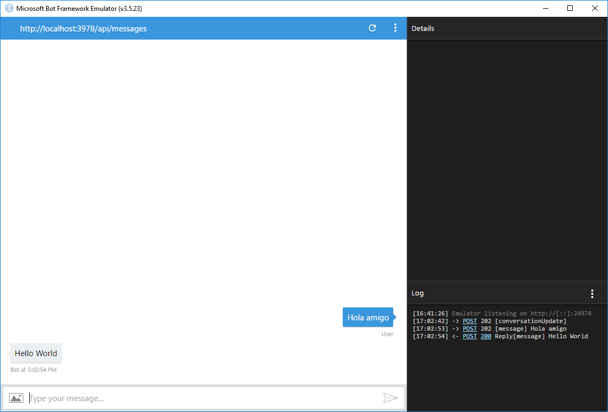

Con esto tenemos funcionando un bot sencillo en nuestro puesto de desarrollo.

## INTERACCIÓN AVANZADA CON NUESTRO BOT 

Ahora que tenemos un bot funcional ejecutando en nuestra máquina y conectado con
**Microsoft Bot Framework Emulator** vamos a dotarle de alguna interacción 
un poco más elaborada.

Para ello, debemos tener en cuenta de que nuestro bot va a funcionar en modo
*cascada* (*waterfall*). Esto quiere decir que el flujo de la conversación estará 
predefinido dentro del mismo. Posteriormente le dotaremos de una interacción
un poco más inteligente y también haremos que reconozca el lenguaje natural

### Paso 9
Vamos a reemplazar el código de nuestro fichero `server.js` por el siguiente:

```javascript
var restify = require('restify');
var builder = require('botbuilder');

//=========================================================
// Bot Setup
//=========================================================

var connector = new builder.ChatConnector({
    appId: process.env.MICROSOFT_APP_ID,
    appPassword: process.env.MICROSOFT_APP_PASSWORD    
});

var bot = new builder.UniversalBot(connector, [
    function (session) {
        builder.Prompts.text(session, "Hello... What's your name?");
    },

    function (session, results) {
        session.userData.name = results.response;
        builder.Prompts.number(session, "Hi " + results.response + ", How many years have you been coding?");
    },

    function (session, results) {
        session.userData.coding = results.response;
        builder.Prompts.choice(session, "What language do you code Node using?", ["JavaScript", "CoffeeScript", "TypeScript"]);
    },

    function (session, results) {
        session.userData.language = results.response.entity;
        session.send("Got it... " + session.userData.name +
            " you've been programming for " + session.userData.coding +
            " years and use " + session.userData.language + ".");
    }

]);

// Setup Restify Server
var server = restify.createServer();
server.listen(process.env.port || process.env.PORT || 3978, function () {
   console.log('%s listening to %s', server.name, server.url); 
});
  
server.post('/api/messages', connector.listen());
```

Si observamos con detenimiento el código fuente, veremos claramente nuestra 
*waterfall* dentro de la llamada a `new builder.UniversalBot(conector,[...`

Ahí podemos apreciar una *cascada* de funciones anónimas que definen el diálogo
en cada uno de las etapas de nuestra cascada.

### Paso 10
Nos vamos a la consola donde teníamos lanzada nuestra aplicación y interrumpimos 
su ejecución pulsando dos veces `Ctrl+C`. Una vez que la ejecución se ha interrumpido
volvemos a lanzar la aplicación con la misma instrucción que en el *paso 5*

```powershell
C:\botlab> node server.js
```
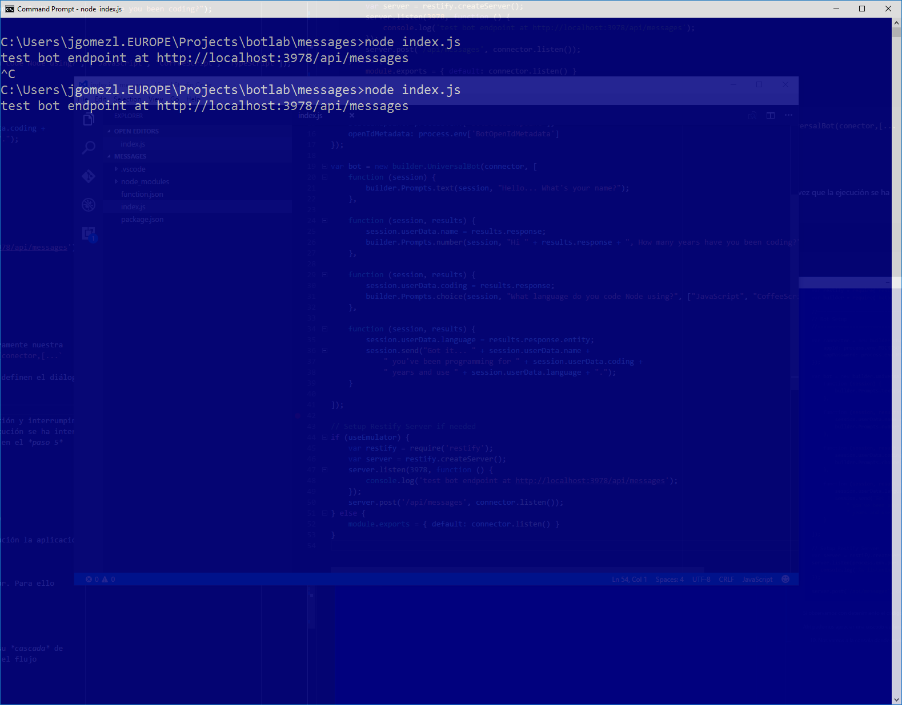

Si no hemos comentido ningún error volvermos a tener en ejecución la aplicación
web que da soporte a nuestro nuevo bot.

### Paso 11
Relanzamos la conversación con el bot, reiniciando el emulador. Para ello 
pulsamos en el botón de `Start new conversation`


### Paso 12
Iniciamos la conversación con el nuevo bot, y respondemos a su *cascada* de 
preguntas. Al finalizar tendremos una conversación que sigue el flujo 
predefinido dentro de nuestra aplicación web.

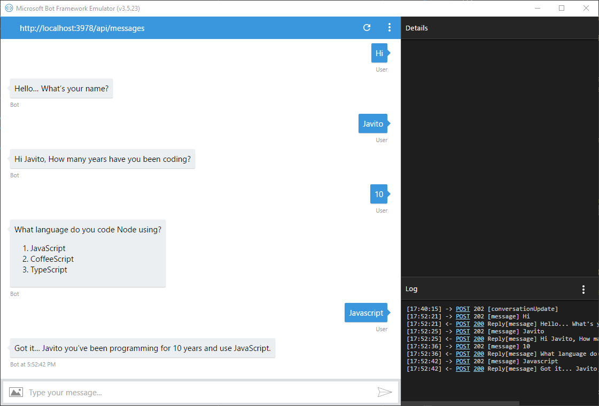

## DESPLIEGUE DE LA SOLUCIÓN EN AZURE
Ahora, vamos a intentar desplegar nuestro bot en Azure. Para ello precisamos de
una subscripción activa de Azure y su correspondiente acceso con las autorizaciones
pertinentes para poder crear recursos en dicha subscripción.

### Paso 13
Accedemos al [portal de administración de Azure](https://portal.azure.com) y
creamos una nueva instancia de **Bot Service** siguiendo las siguientes 
opciones del portal `New > Intelligence+analytics > Bot Service`

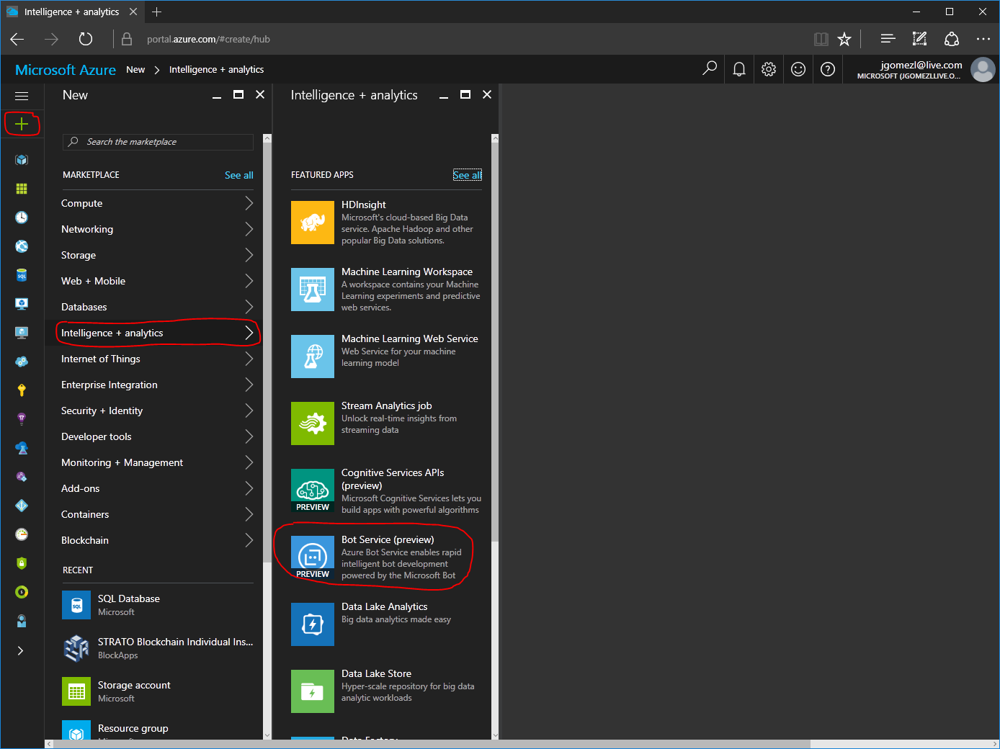

### Paso 14 

Nos aparecerá un cuadro de diálogo donde deberemos introducir los datos básicos
de identificación y ubicación de nuestro bot.


Una vez introducidos los datos, y si estos son correctos, pulsamos `Create`. Esto 
nos creará una instancia de un Bot Service. Volvemos al inicio del portal y 
localizamos dicha instancia y accedemos a su "blade" de administración.

Dentro del blade tendremos la posibilidad de crear un **Microsoft App ID** y una 
password para nuestro bot. Pulsamos en el boton correspondiente.

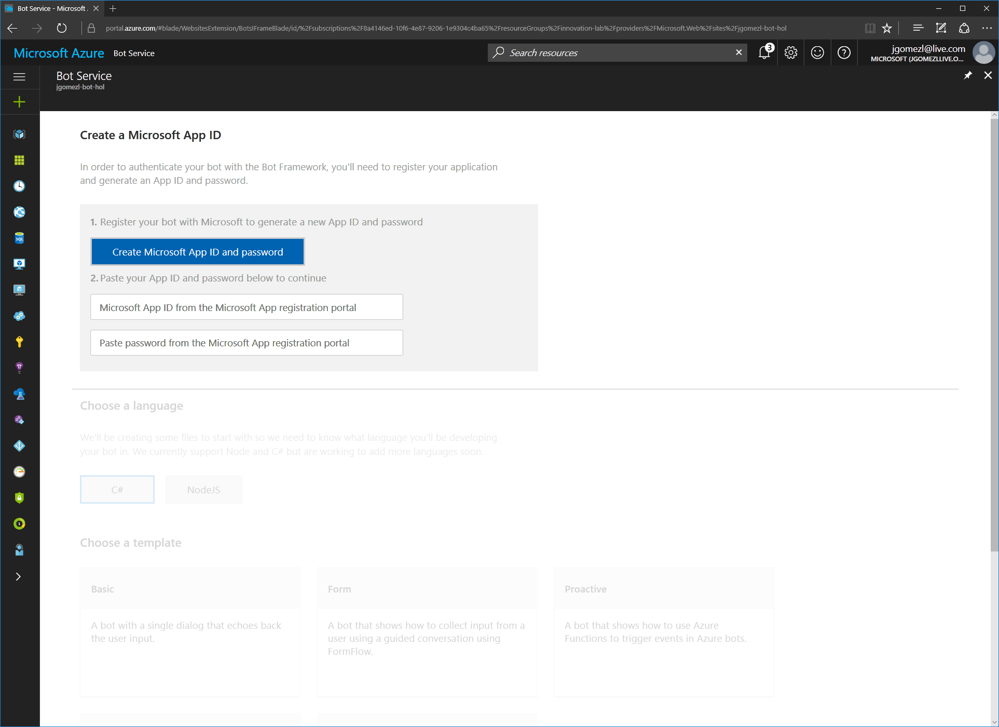

_En caso de que ya tuvieramos creado el bot anteriormente dentro del portal 
de Bot Framework, también podríamos pegar sus datos en los campos correspondientes
del formulario_

Al pulsar en el boton de creación nos aparecerá una pantalla adicional donde 
tendremos el nombre de nuestro bot y su correspondiente **Microsoft App ID**

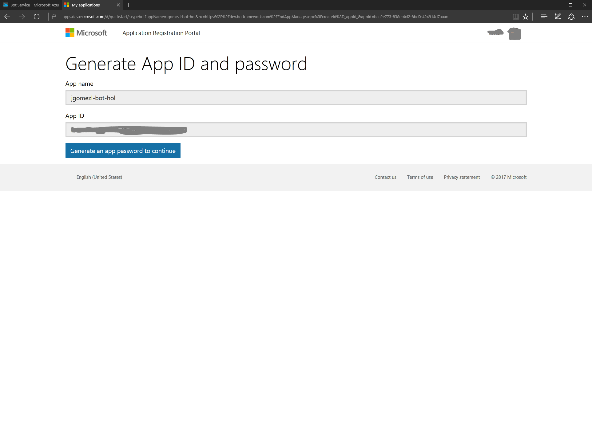

Pulsamos en el boton para generar la password de nuestro bot. Nos aparecerá un 
cuadro de diálogo con la password. 

**Es importante tomar nota de dicha password**

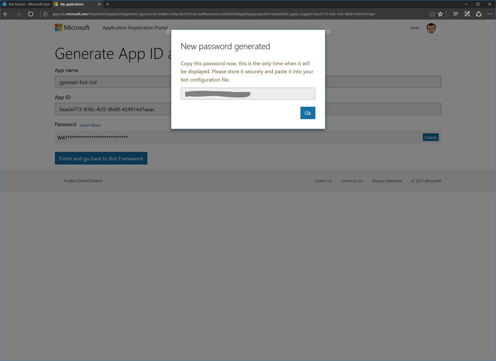

Cerramos el cuadro de diálogo y también pulsa en el boton de finalización.

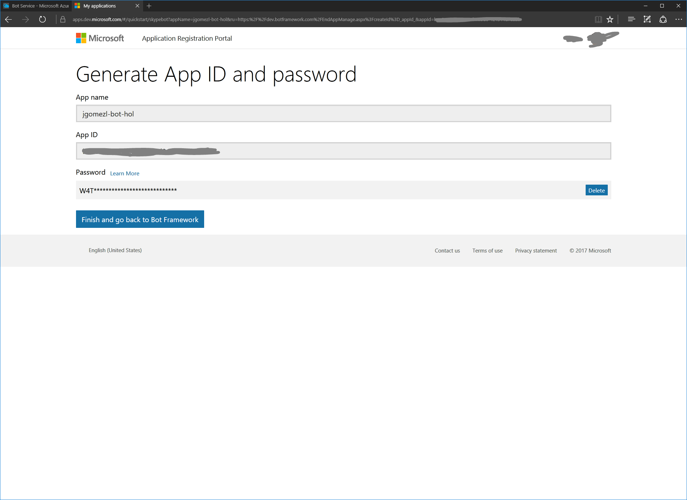

Volvemos al *blade* de creación del bot con los datos y solo habremos de pegar 
la password obtenida, seleccionar el lenguaje en que hemos programado nuestro bot (NodeJS) 
y seleccionaremos la plantilla básica. Finalmente pulsamos sobre el botón de `Crear Bot`

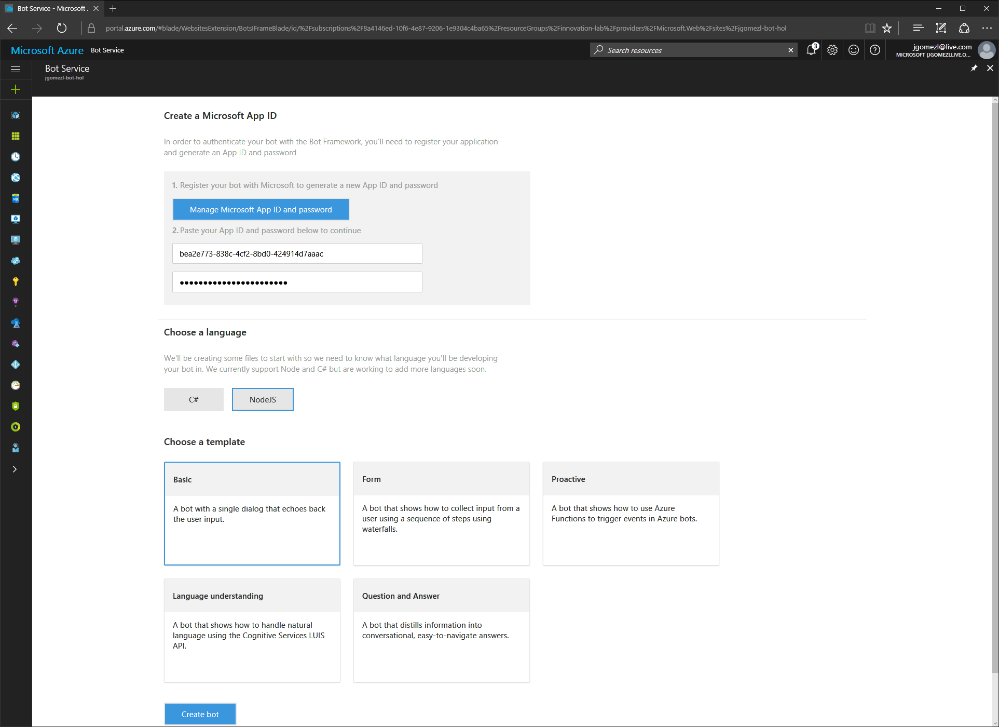


### Paso 15

Al crear la instancia de **Bot Service** tendremos ahora un *blade* desde el 
que tendremos las herramientas necesarias para desarrollar, integrar, configurar 
y publicar nuestro bot.

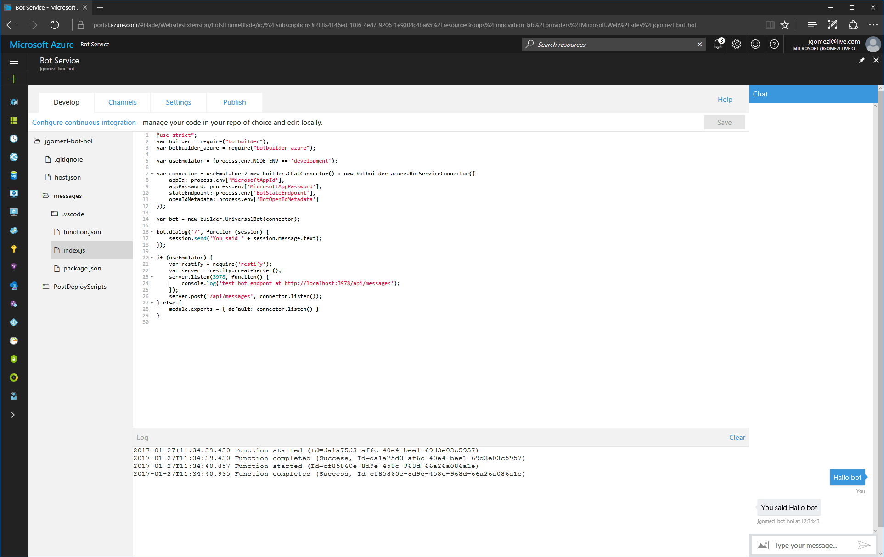


