# BOT FRAMEWORK + LUIS (SEGUNDA PARTE)
* [INTRODUCCIÓN](#introducciÓn)
* [OBTENCIÓN CREDENCIALES DE DESPLIEGUE](#obtenciÓn-credenciales-de-despliegue)
* [DESPLIEGUE FTP](#despliegue-ftp)
* [CREACIÓN DEL MODELO CON LUIS](#creaciÓn-del-modelo-con-luis)
* [INTEGRACIÓN DE LUIS CON EL BOT](#integraciÓn-de-luis-con-el-bot)
* [DESPLIEGUE EN AZURE](#despliegue-en-azure)

## INTRODUCCIÓN
En este segunda parte de nuestro laboratorio continuaremos con el despligue de 
nuestro bot en la instancia de Bot Service que creamos en nuestra subscripción de Azure.

> NOTA
Esta segunda parte del laboratorio requiere haber completado con éxito las 
instrucciones del [laboratorio anterior](./README.md)

## OBTENCIÓN CREDENCIALES DE DESPLIEGUE

### Paso 1
Vamos a desplegar nuestro nuevo bot mediante FTP. Para ello deberemos obtener 
las credenciales FTP para poder acceder en nuestra instancia de **Bot Service**
en Azure. 

Dentro del *blade* de configuración de nuestra instancia de **Bot Service** que 
teníamos abierta en el [Paso 4 del laboratorio anterior](./README.md#paso-4),
accedemos a la sección de **Advanced Settings**

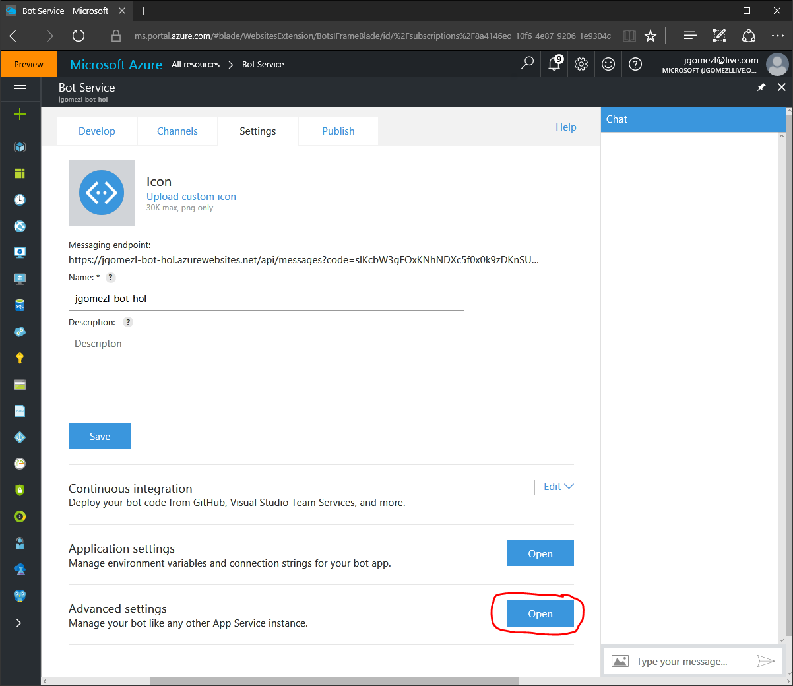

Nos llevará a un nuevo *blade* de configuración del servicio **Azure Functions** 
que da soporte a nuestro **Bot Service**. Aquí podremos acceder a las credenciales
de despliegue de nuestro bot (**Deployment credentials**)

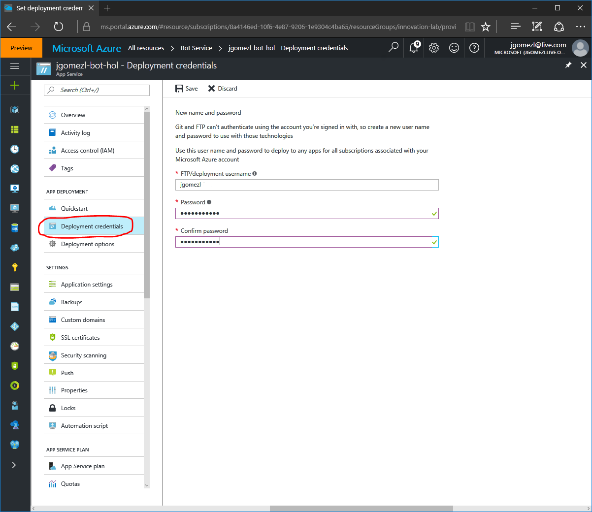

En dicho *blade* introducimos un *username* y una contraseña que utilizaremos
con posterioridad para acceder por FTP. Pulsamos sobre el botón `Save`

Ahora accedemos a las propiedades generales de nuestra instancia para 
obtener la dirección FTP que deberemos utilizar.

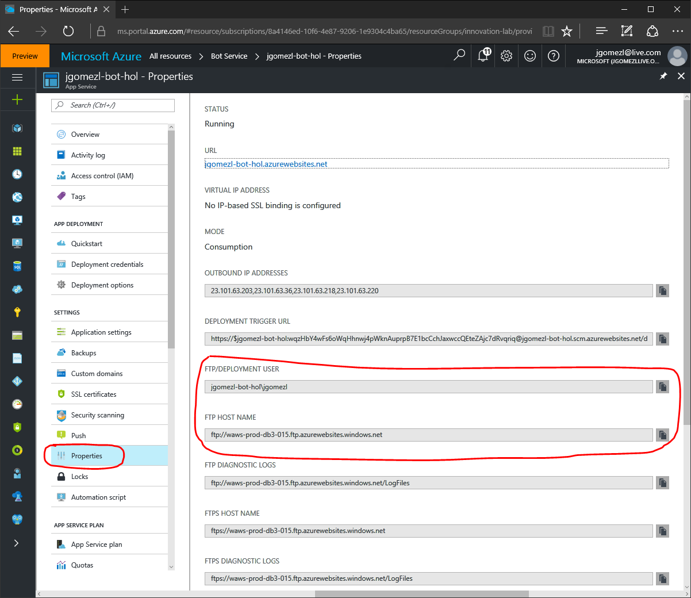

## DESPLIEGUE FTP

### Paso 2
Ahora deberemos acceder mediante FTP a nuestro **Azure Function** que dará 
soporte de ejecución a nuestro bot. Para ello deberemos utilizar un cliente FTP
configurándole con las credenciales obtenidas en el paso anterior.

En este caso hemos utilizado [Filezilla](https://filezilla-project.org) 

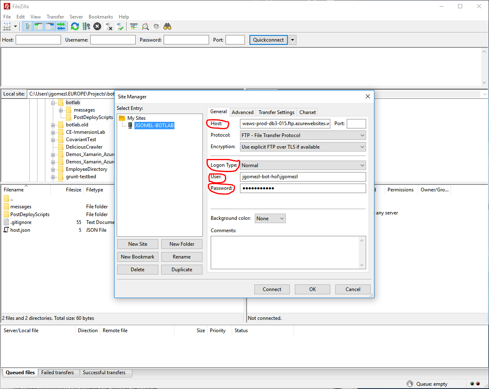

Una vez configurado el cliente FTP, accedemos a nuestro sitio en Azure.

> NOTA
Es posible que la primera vez que conectamos, si utilizamos FTP sobre TLS se 
nos pida confirmación de aceptación del certificado de Azure. Si es así, 
simplemente aceptaremos el certificado, y opcionalmente marcaremos la opción
de confiar en el mismo certificado en sucesivas conexiones si lo 
consideramos oportuno

Si todo ha ido correctamente, estaremos conectados a nuestro sitio en Azure, 
tal y como muestra la siguiente imagen.

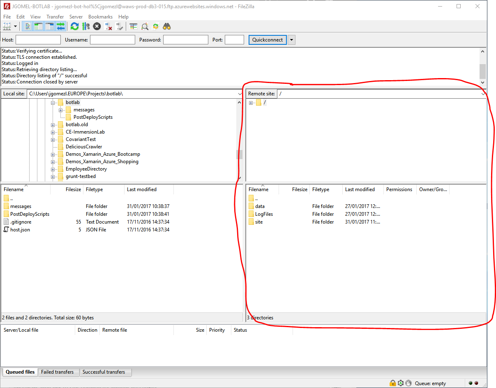

Nos posicionaremos localmente en nuestra carpeta de proyecto, donde hemos 
salvado nuestro fichero `index.js` con la interacción avanzada de la
[anterior parte del laboratorio ](./README.md##interacciÓn-avanzada-con-nuestro-bot)

En la parte remota, nos posicionaremos en la correspondiente carpeta dentro del 
servidor (`/site/wwwroot/messages`). Una vez posicionados correctamente tanto
en la parte local como en el servidor, procederemos a sobreescribir el fichero 
`index.js`del servidor con la copia local de nuestra carpeta de proyecto.

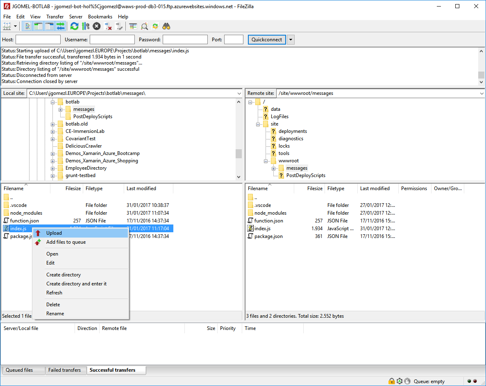

Si todo funciona correctamente, y el fichero es subido correctamente, esperaremos 
3-4 minutos para dar tiempo a que nuestra instancia de **Bot Service** reconozca
los cambios y actualice nuestro Bot.

Pasado ese tiempo, volveremos al portal de Azure y accederemos al *blade* generales
de nuestro bot, el cual deberá estar ya mostrando los cambios realizados en 
el fichero `index.js`. Incluso podremos probar nuestras modificaciones utiizando
el emulador de bot embebido en el portal de Azure.

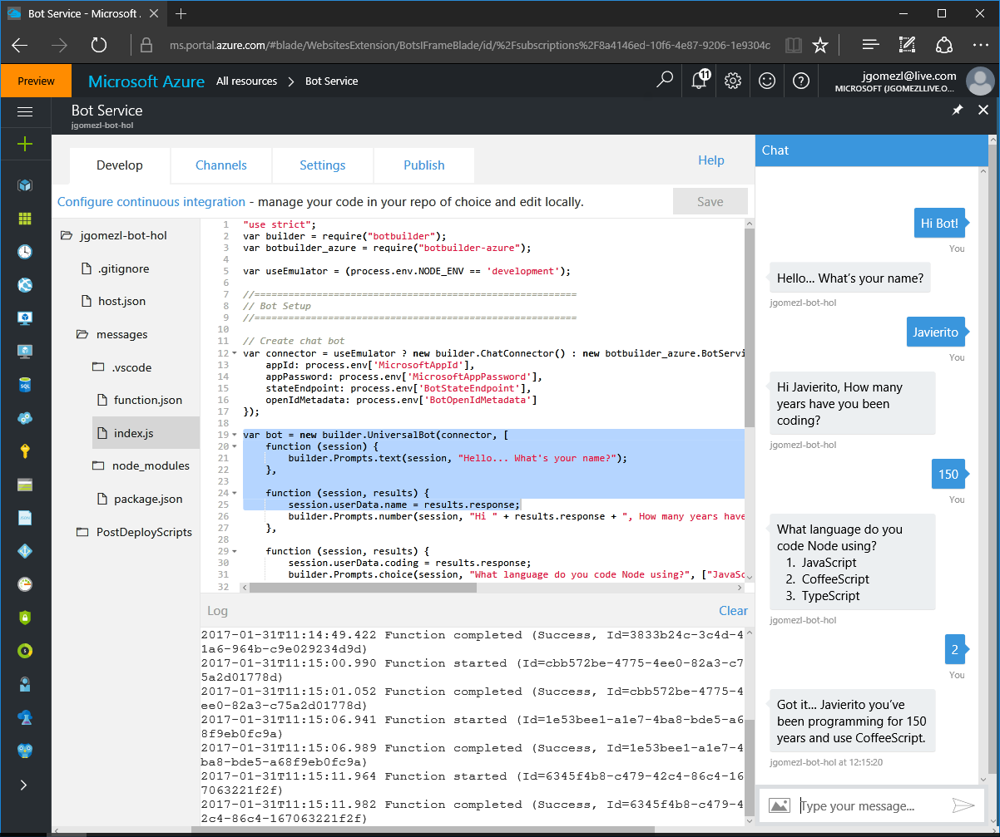

## CREACIÓN DEL MODELO CON LUIS

### Paso 3
En el siguiente apartado vamos a empezar a utilizar el servicio de **Reconocimiento 
del Lenguaje (LUIS)**. Para ello accederemos a [www.luis.ai](http://www.luis.ai) 
y procederemos identificarnos como desarrollador. Si no tenemos cuenta deberemos
registrarnos como desarrolladores en la misma página.

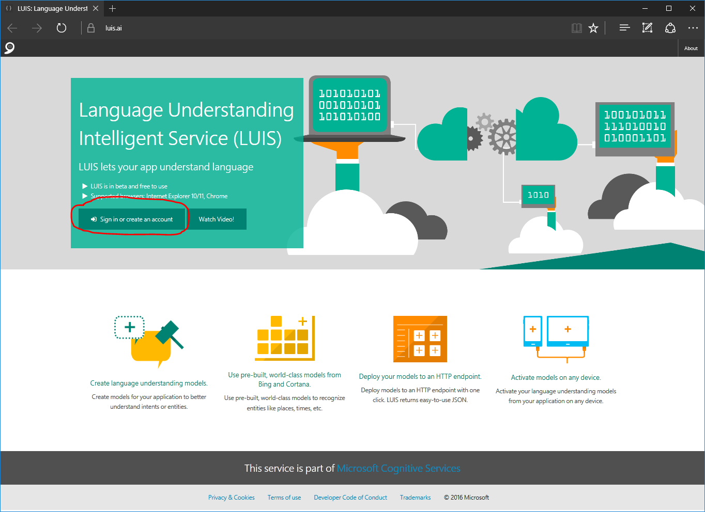

Una vez identificados entraremos en la gestión de las aplicaciones que tengamos
creadas en nuestra cuenta de LUIS.

Procedemos a dar de alta una aplicación nueva utilizando el botón a tal efecto.


Nos aparecerá un formulario donde deberemos introducir algunos datos básicos de
nuestra aplicación. En este caso aparte de los datos básicos, hemos seleccionado 
que nuestro escenario de aplicación de LUIS será un Bot, y que nuestra 
aplicación funcionará para idioma Castellano.

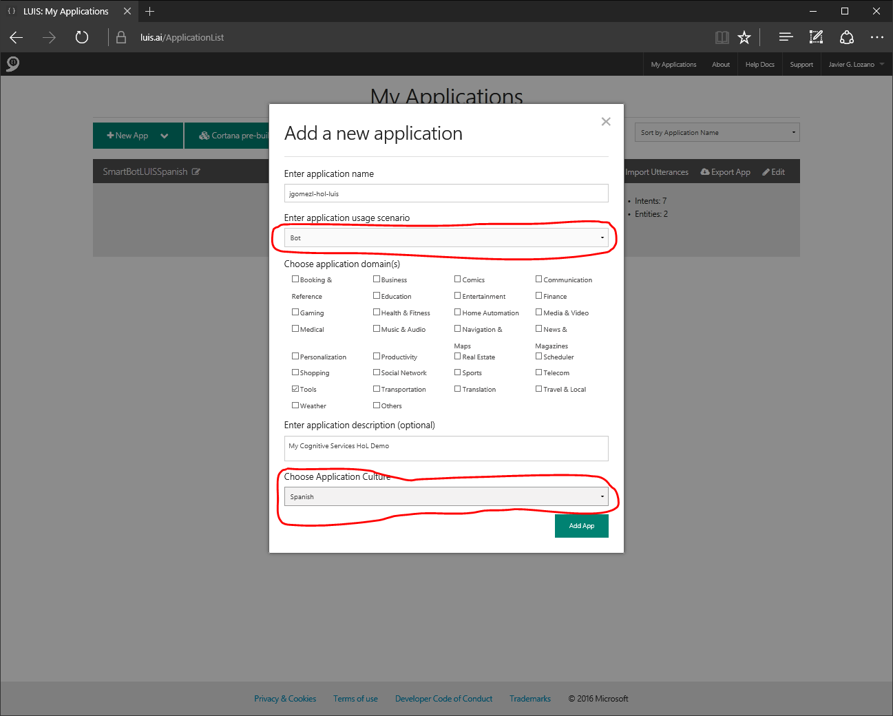

Pulsamos el botón de `Add App`y pasaremos a una página donde definiremos y
gestionaremos el modelo que soportará nuestra aplicación.

> NOTA
En este laboratorio no entraremos en detalle sobre cómo definir y gestionar
modelos complejos para reconocimiento de lenguaje natural. Si se tiene interés 
en profundizar más se recomienda seguir el
[Tutorial de LUIS](http://www.luis.ai/Help)

### Paso 4 
Vamos a empezar por añadir ciertas entidades predefinidas dentro de nuestra 
aplicación. Las entidades predefinidas permiten a nuestro modelo reconocer
cierto tipos de entidades sin necesidad de definirlas ni entrenar nuestro modelo
para ello.

Pulsamos en el botón `Pre-built Entities` y en el dialogo de selección elegimos
las entidades `datetime`, `number` y `money`. Finalizamos pulsando el botón `Ok`

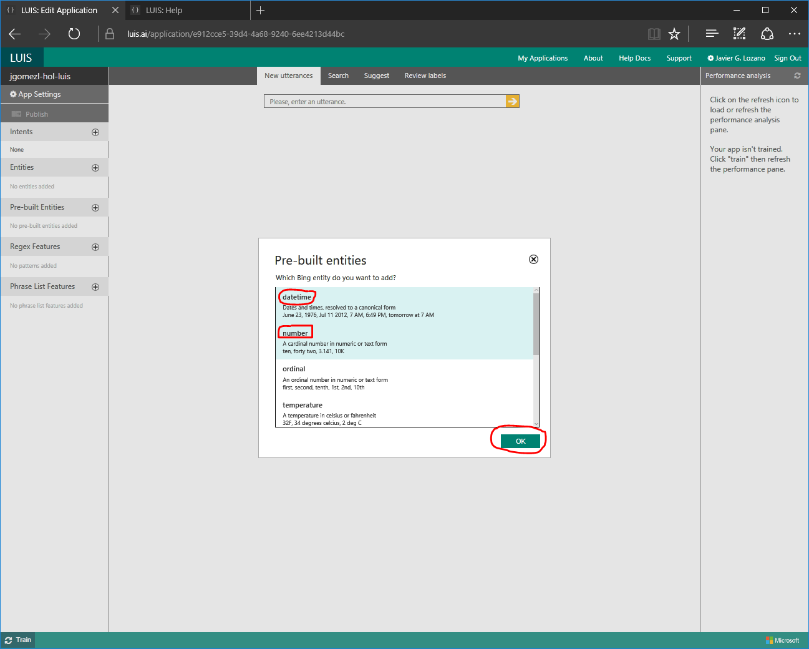

### Paso 5
Añadiremos también algunas entidades definidas por nosotros para su utilización 
posterior. Pulsamos en el botón de `Entities` y añadimos una entidad denominada 
`stockid` que n os servirá para entender *tickers* de bolsa.

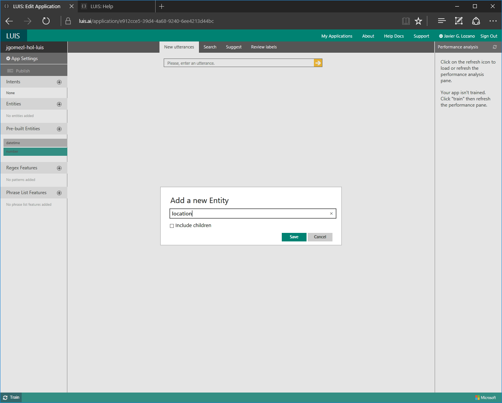

### Paso 6
A continuación, definiremos cuales serán los `intents` que queremos que nuestro
modelo de LUIS reconozca. Los `intents` no son más que las necesidades o las
intenciones que nuestros interlocutores quieren expresar cuando interactúan 
con nuestro modelo.

En nuestro bot vamos a intentar reconocer cuando alguien quiere  saber la 
cotización de una acción (*stock*) y le permitiremos solicitar ayuda sobre el 
uso del bot.

Empezamos por definir el *intent* `getstockquote`. Pulsamos en el botón `Intents` 
y rellenamos el formulario que nos aparece.

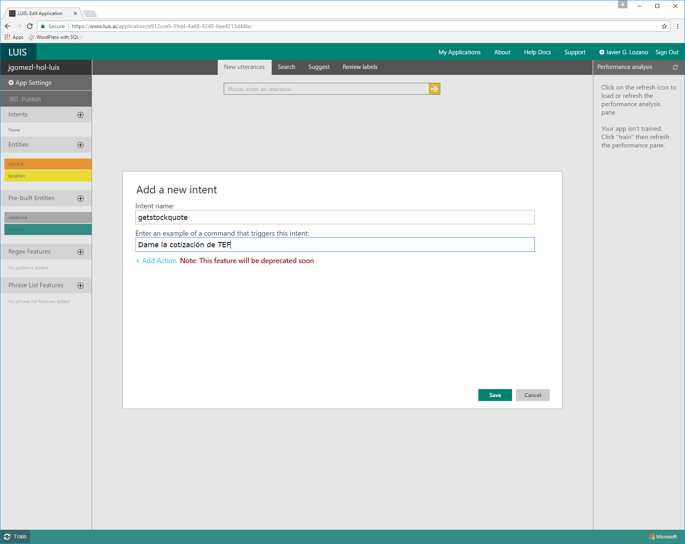

Nos aparecerá como primera declaración (*utterance**) para entrenar nuestro 
modelo aquella que hemos introducido como ejemplo al definir el `intent`. 

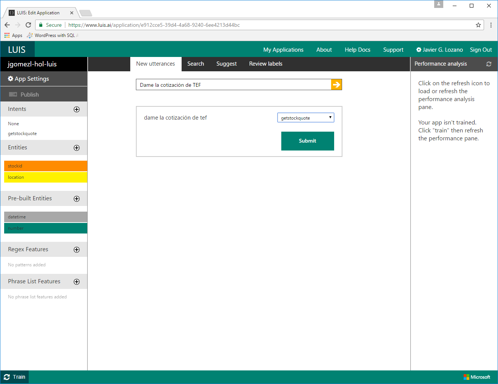

Revisamos que sea correcta y que la intención asociada sea la que queremos y en
caso afirmativo la enviamos a nuestro modelo mediante el botón `Submit`.

Defimos de manera similarel *intent* `gethelp`.

### Paso 7 
Ahora que tenemos nuestras entidades y las intenciones definidas, procederemos
a entrenar el modelo para que vaya ajustando su nivel de reconocimiento.

Para ello vamos introduciendo nuevas sentencias en la pestaña de `New utterances` 
y procederemos a asociar los `intents`y las `entidades` correctas en caso de
que el modelo no las reconozca adecuadamente

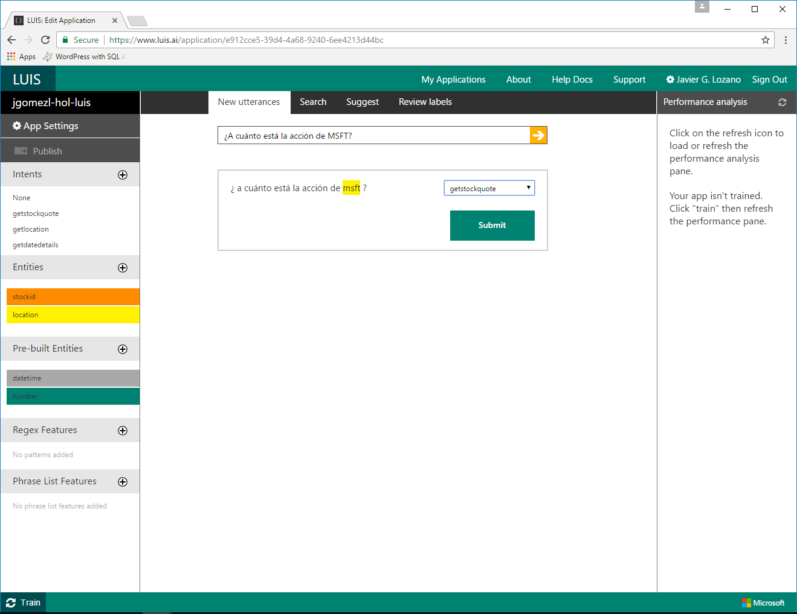

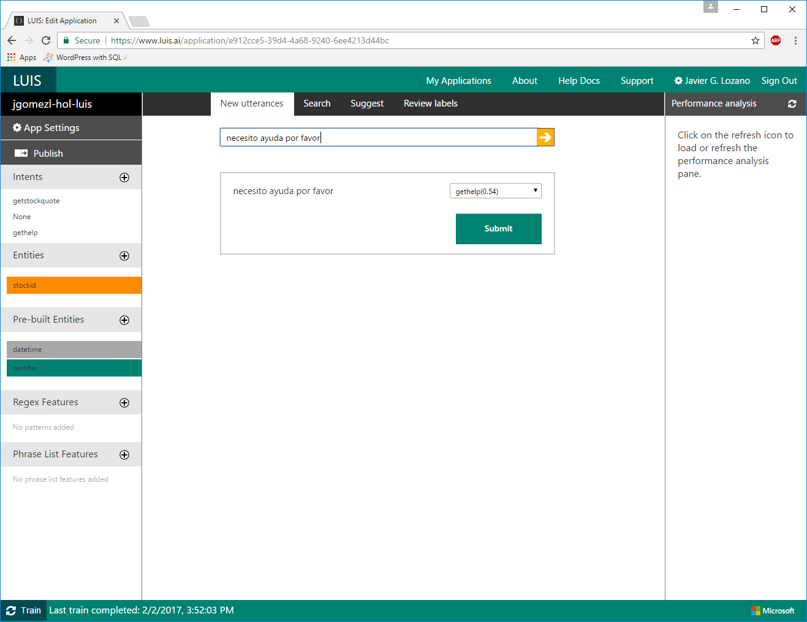 

Una vez que hemos finalizado de introducir declaraciones en nuestro modelo,
pulsaremos el botón `Train` para actualizar nuestro modelo de reconocimiento

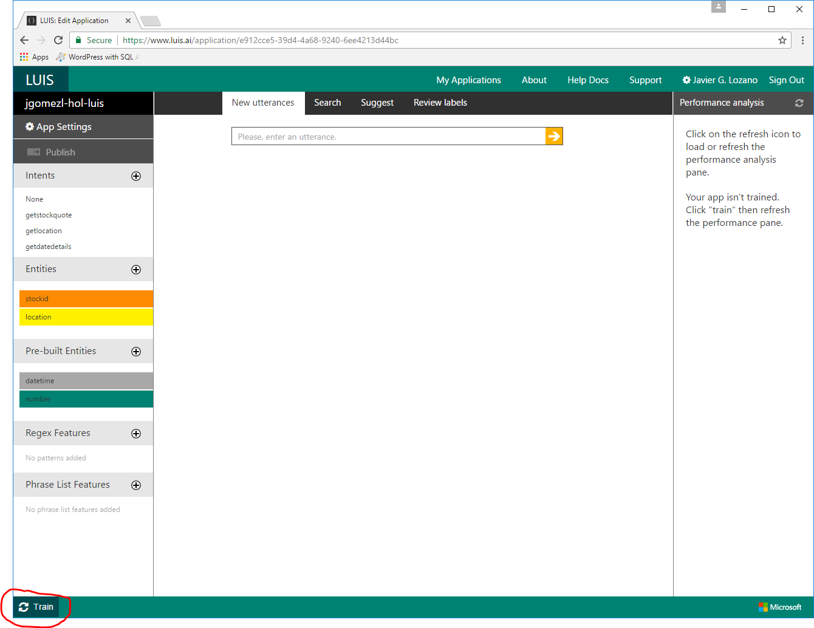 

Tomará unos instantes el poder entrenar nuestro modelo. Una vez que esté 
finalizado el proceso, pulsamos el botón de `Publish` y rellenamos los datos 
que nos solicitan.

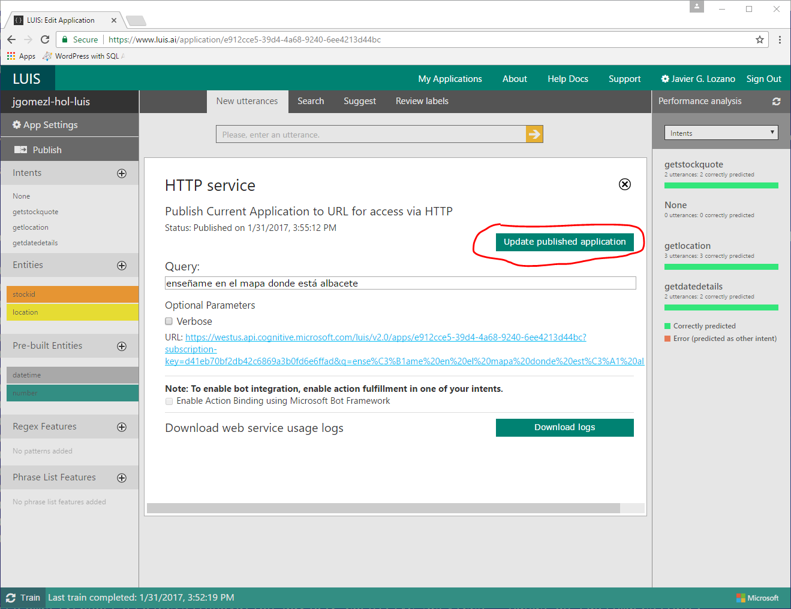 

## INTEGRACIÓN DE LUIS CON EL BOT

En este apartado modificaremos el bot que tenemos desarrollado para que integre
con el modelo de reconocimiento del lenguaje que acabamos de definir en LUIS.

### Paso 8
Primero añadiremos un par de dependencias NPM a nuestro proyecto. Para ello
nos posicionamos dentro del directorio donde está nuestro fichero `index.js`
y abrimos una consola de comandos. Dentro de dicha consola tecleamos las siguientes
instrucciones:

```
C:\botlab\messages\> npm install node-bing-api --save
C:\botlab\messages\> npm install yahoo-finance --save 

```  
Estas dependencias permitirán a nuestro bot pedir información financiera sobre una 
compañía mediante los servicios de **Yahoo Finance** y su noticias asociadas mediante el 
API de **Bing Search**.

> NOTA 
Para poder utilizar los servicios de búsqueda de noticias de Bing, es necesario
disponer de un *API Key* para el servicio. Dicho servicio es parte de los 
*Cognitive Services* por lo que podemos solicitar dicha clave en el 
[Portal de desarrolladores de Cognitive Services](http://dev.cognitive.microsoft.com)

Volvemos a nuestro ventana de **Visual Studio Code** y en el fichero `index.js` 
sustituimos el código existente por el siguiente:

```javascript
"use strict";
var builder = require("botbuilder");
var botbuilder_azure = require("botbuilder-azure");
const util = require('util');
// DO NOT FORGET TO UPDATE WITH YOUR OWN BING NEWS API KEY!!!
var bing = require('node-bing-api')({ accKey: "5d6c5bed99364dd28fb726b38201b69a" });
var yahooFinance = require('yahoo-finance');

var useEmulator = (!process.env.NODE_ENV) ? true : (process.env.NODE_ENV == 'development');

// Create chat bot
var connector = useEmulator ? new builder.ChatConnector() : new botbuilder_azure.BotServiceConnector({
    appId: process.env['MicrosoftAppId'],
    appPassword: process.env['MicrosoftAppPassword'],
    stateEndpoint: process.env['BotStateEndpoint'],
    openIdMetadata: process.env['BotOpenIdMetadata']
});

var bot = new builder.UniversalBot(connector, {
    localizerSettings: { defaultLocale: "es" }
});

// DO NOT FORGET TO UPDATE WITH YOUR OWN LUIS API KEY 
var model = "https://westus.api.cognitive.microsoft.com/luis/v2.0/apps/e912cce5-39d4-4a68-9240-6ee4213d44bc?subscription-key=d41eb70bf2db42c6869a3b0fd6e6ffad";
var recognizer = new builder.LuisRecognizer(model);
var intents = new builder.IntentDialog({ recognizers: [recognizer] });

// Now register begin conversation dialog
intents.onBegin(function (session, args) {
    session.send("Hola. ¿Cómo puedo ayudarte?");
});

// Register default dialog for non-recognized utterances
intents.onDefault(builder.DialogAction.send("Lo siento, eso no lo he entendido. ¿Me lo puedes explicar mejor?"));

// Now define intentss based on intents and entities
// Intent: getlocation
intents.matches('getstockquote', [
   // First step of the dialog
    function (session, args, next) {
        var stockIdEntity = builder.EntityRecognizer.findEntity(args.entities, 'stockid');
        var stockId = session.dialogData.stockId = (stockIdEntity) ? stockIdEntity.entity : null;
        console.log('Intent "getstockquote" stock:' + stockId);
        next();
        // Let's get the stock info from Yahoo! Finance
        yahooFinance.snapshot({
            symbol: session.dialogData.stockId
        }).then(function (data) {
            console.log(data);
            var fmt = new Intl.NumberFormat();
            var stockQuote = session.dialogData.stockQuote = data;
            session.send("Stock %s [%s] Precio %s (%s) Volumen %s",
                stockQuote.name,
                stockQuote.symbol,
                fmt.format(stockQuote.lastTradePriceOnly, { style: 'currency', minimumFractionDigits: 2 }),
                fmt.format(stockQuote.change, { style: 'percent', minimumFractionDigits: 2 }),
                fmt.format(stockQuote.volume, { style: 'decimal', minimumFractionDigits: 2 }));
            builder.Prompts.confirm(session,
                util.format("¿Quieres que te muestre las últimas noticias sobre '%s'?", stockQuote.name),
                { localizationNamespace: 'es' });
        },function (reason) {
                session.send("Lo siento pero no he sido capaz de encontrar información sobre '%s'",
                    session.dialogData.stockId);
        })
    },
    // Second step of the dialog
    function (session, results, next) {
        if (results.response) {
           // Let's get the news about the company from Bing
            bing.news(session.dialogData.stockQuote.name, 
                {top: 3},
                function (error, res, body) {
                if (body.value.length > 0) {
                    session.send("Esto es lo que encontré sobre '%s'\n", session.dialogData.stockQuote.name);
                    body.value.forEach(function (element) {
                        var card = new builder.HeroCard(session)
                            .title(element.name)
                            .text(element.description)
                            .buttons([builder.CardAction.openUrl(session, element.url, "Navegar")]);
                        var msg = new builder.Message(session).addAttachment(card);
                        session.send(msg);
                    });
                }
                else {
                    session.send("Pues parece que no hay muchas noticias hoy sobre ello");
                }
            });
        }
    }
]);
// Intent: gethelp
intents.matches('gethelp', function (session, args) {
    session.send("Soy un bot bastante listo y sé mucho sobre cotizaciones de bolsa. Ponme a prueba")
});

bot.dialog('/', intents);

// Setup Restify Server if needed
if (useEmulator) {
   var restify = require('restify');
   var server = restify.createServer();
   server.listen(3978, function () {
        console.log('test bot endpoint at http://localhost:3978/api/messages');
   });
   server.post('/api/messages', connector.listen());
} else {
   module.exports = { default: connector.listen() };
}
```

> **NOTA** ES IMPORTANTE RECORDAR QUE HAY QUE ACTUALIZAR EL CÓDIGO FUENTE ANTERIOR
CON LAS CLAVES DE ACCESO QUE HAYAMOS GENERADO POR NUESTRA CUENTA PARA **LUIS** 
Y PARA EL API DE **BING NEWS**. 
De lo contrario estaremos utilizando las utilizadas durante la elaboración de este
HoL que es posible que ya no estén disponibles.

Si se observa el código adjunto, nuestro bot define dos dialogos basados en 
`intents`. Uno de ellos gestiona el dialogo para obtener la cotización y las 
noticias asociadas de un *ticker* y el segundo es el diálogo cuando el usuario
solicita ayuda al bot.

Comprobamos que nuestro bot funciona correctamente con el nuevo código,
utilizando el emulardor tal y como se hizo en el
[Paso 6 del laboratorio anterior](./README.md#paso-6)

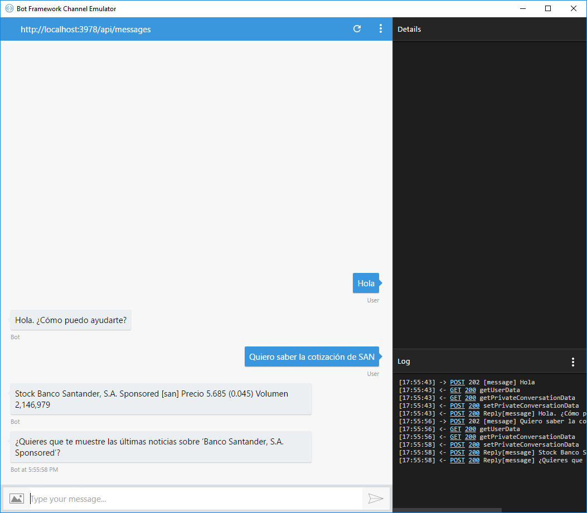

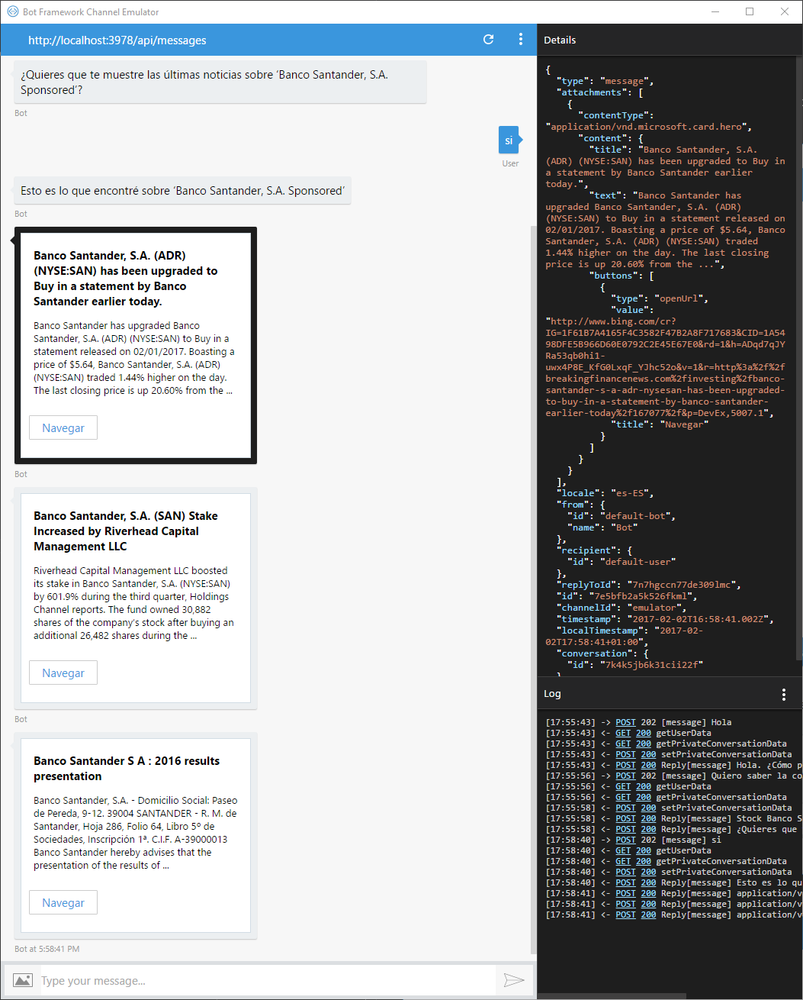

Como se puede ver, el bot es capaz de entender peticiones realizadas en 
lenguaje natural, acceder a servicios REST para obtención de la información
solicitada, y además presentarla en *Cards* de una manera rica (*Las HeroCard 
pueden no estar soportadas en todos los canales posibles a los que podeos conectar 
nuestro bot, como por ejemplo SMS*)

Vamos a desplegar la nueva lógica de nuestro bot en la instancia de *Bot Service* 
que tenemos en Azure.

## DESPLIEGUE EN AZURE 

### Paso 9
Ahora, utilizando FTP procedemos a subir los ficheros `package.json` e `index.js`
dentro del correspondiente directorio de nuestra instancia tal y como realizamos
en el [Paso 2 de este laboratorio](#Paso-2)

### Paso 10
Una vez subido el código, debemos forzar a que la aplicación restaure sus 
dependencias NPM en Azure. Para ello abrimos el *blade* de configuración avanzada
de nuestro bot y seleccionamos la opción `Console`

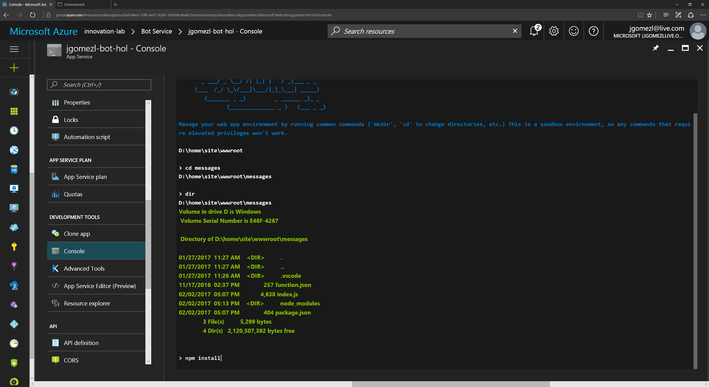

Dentro de la consola, nos posicionamos en el directorio de la aplicación del
bot en el que está el fichero `package.json`y tecleamos:

```powershell
> npm install
```

Esto restaurará las dependencias nuevas para poder acceder a **Yahoo! Finance API** y 
**Bing Search API**

Una vez finalizada la restauración de dependencias, damos unos minutos a 
nuestro bot para que refresque la instancia con los cambios y ya tendremos
disponible la nueva lógica en nuestra instancia en Azure.

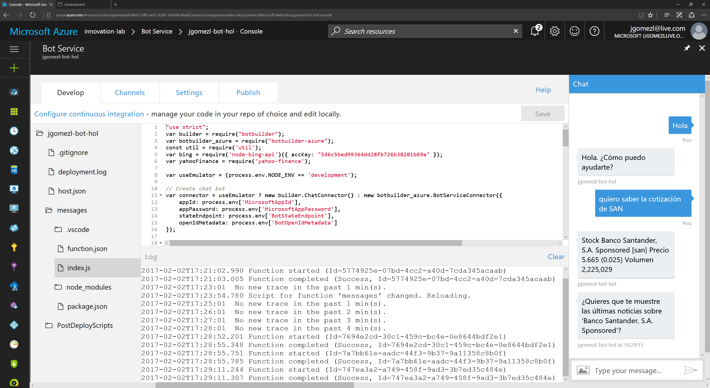 

Ahora ya solo resta, publicar nuestro bot para poderlo conectar en diversos
canales y que la gente lo pueda acceder.

Eso lo haremos en la [tercera parte de nuestro laboratorio](./third-lab.md)
