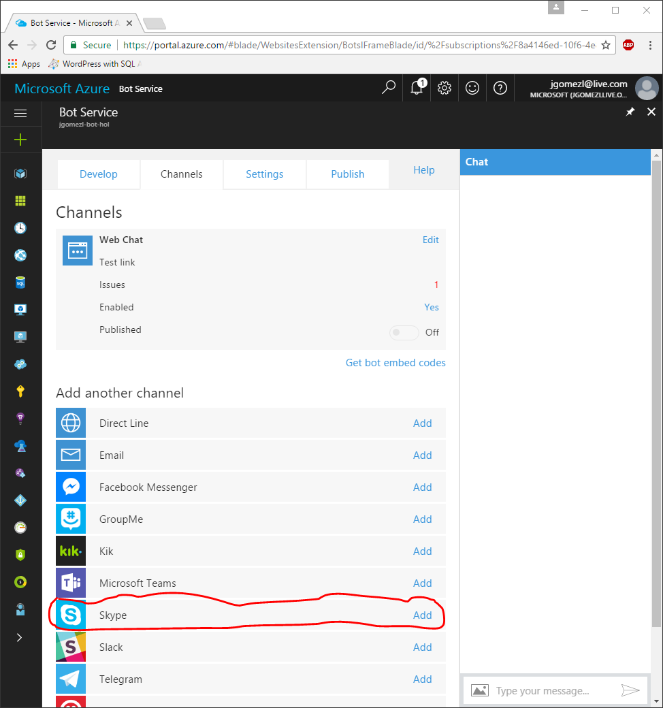
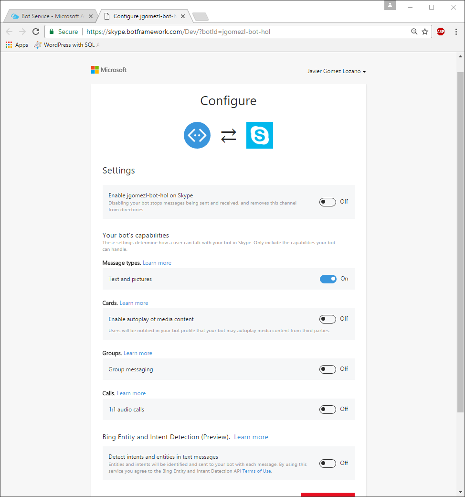
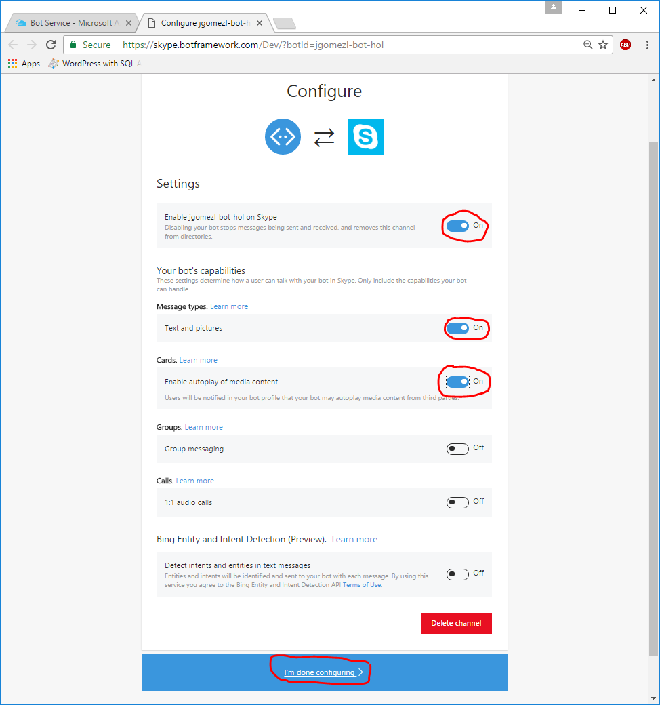
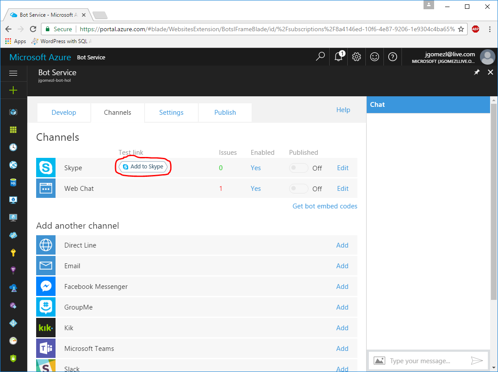
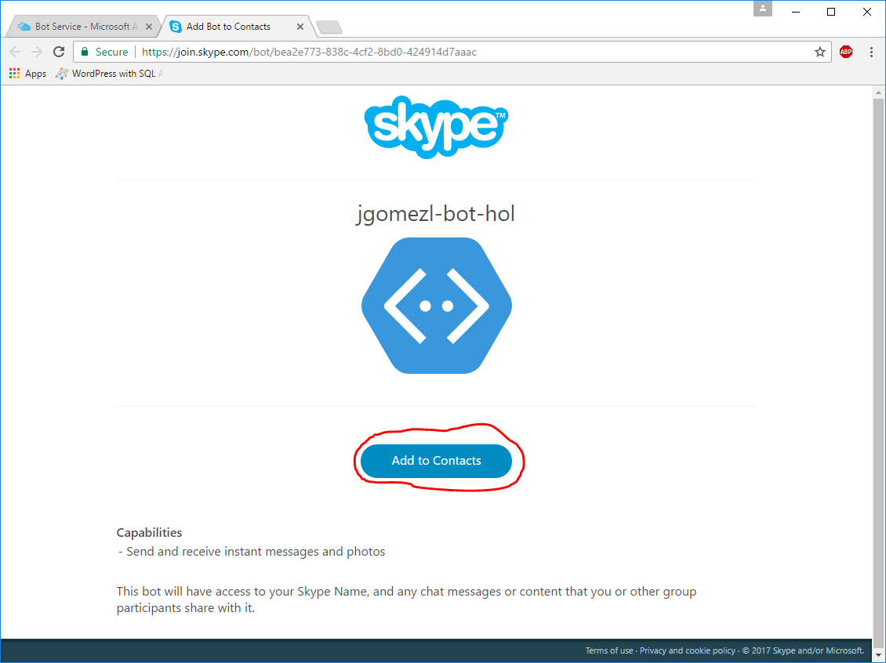
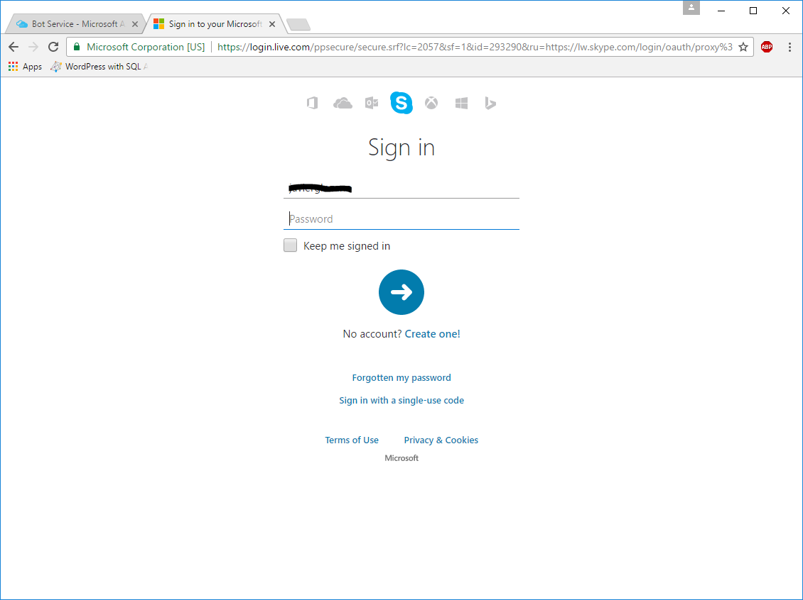
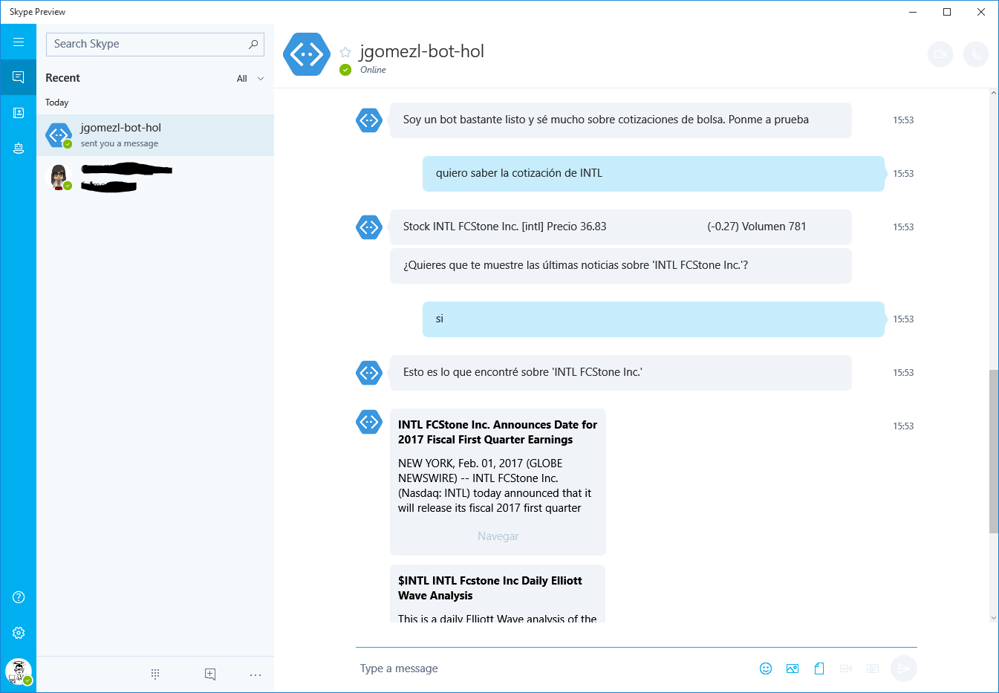

# BOT FRAMEWORK + LUIS (TERCERA PARTE)
* [INTRODUCCIÓN](#introducción)
* [CONFIGURACIÓN DE CANALES](#configuraciÓn-de-canales)
* [CONCLUSIÓN Y SIGUIENTES PASOS](#conclusiÓn-y-siguientes-pasos)

## INTRODUCCIÓN
En esta tercera parte de nuestro laboratorio integraremos nuestro bot para que esté
disponible a través de varios canales.

#### NOTA
**Esta segunda parte del laboratorio requiere haber completado con éxito las 
instrucciones del [laboratorio anterior](./second-lab.md).**

## CONFIGURACIÓN DE CANALES

### Paso 1
Accedemos al portal de Azure, y dentro del *blade* de administración de nuestra
instancia de **Bot Service** accedemos a la pestaña de *Channels*.
Dentro de dicha pestaña, buscamos entre los canales disponibles el de *Skype*

### Paso 2

Una vez localizado, pulsamos en el enlace de *Add* para configurar el canal. En 
nuestro navegador se abrirá una nueva pestaña desde la que podremos configurar
la disponibilidad de nuestro bot en en canal de Skype.

#### NOTA 
Si no estuvieramos identificados dentro de la página de Botframework, se nos 
solicitarían los datos de acceso.

### Paso 3
Habitlitamos el canal de Skype para nuestro bot, y además configuramos que 
soporte mensajes con texto e imágenes y también habilitamos el uso de **Cards**
dentro de dicho canal (*Si observamos el código fuente de nuestro bot, veremos 
que hace uso de HeroCards para presentar las noticias*)

Una vez configurados los 3 ajustes, pulsamos en el boton inferior para finalizar
la configuración del canal.

Este último paso, nos devolverá al portal de Azure, dentro del *blade* de
canales de nuestro **Bot Service** en el cual, nos aparecerá **Skype** como canal
disponible. Encontraremos un enlace de test para añadir nuestro canal a los
contactos de nuestra cuenta de **Skype**

### Paso 4

Pulsamos en el enlace para añadir el bot a nuestros contactos de Skype. Nos
aparecerá una nueva ventana en la que tendremos un botón para ello.

Al pulsar el botón se nos pediré que indiquemos a qué usuario de Skype queremos 
añadirle el bot como contacto.

### Paso 5

Una vez añadido el bot, tendremos una página de confirmación y podremos acceder
a nuestra cuenta de **Skype** y entre nuestros contactos tendremos disponible
nuestro bot con el que podremos interactuar sin problemas.

## CONCLUSIÓN Y SIGUIENTES PASOS

Hasta aquí, hemos desarrollado un bot que hace uso de los servicios de reconocimiento
de lenguaje natural (LUIS) dentro de los **Microsoft Cognitive Services**. 

También hemos desplegado nuestro bot utilizando el servicio **Bot Service** que 
está disponible dentro de Azure.

Por último, hemos configurado nuestro bot para que pueda ser accedido a través
del canal de **Skype**.

Se deja como ejercicio a los lectores los siguientes puntos:

* Aumentar la inteligencia del bot, añadiendole nuevos *Intents* y *Entities*. 
Por ejemplo, sería interesante ver cómo el bot puede tomar nota de nuestras
acciones (*stocks*) favoritas y darnos la cotización de un portfolio en un 
momento dado.

* Configurar canales adicionales para acceder a nuestro bot. Unos canales muy 
interesantes pueden ser puede ser **Facebook Messenger** o **Slack**

* Publicar nuestro bot dentro del **[Bot Directory](https://bots.botframework.com/)**

